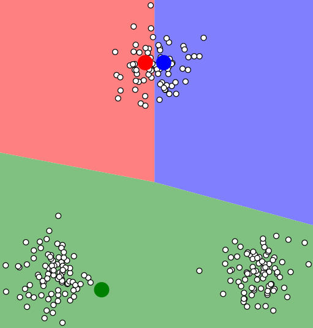
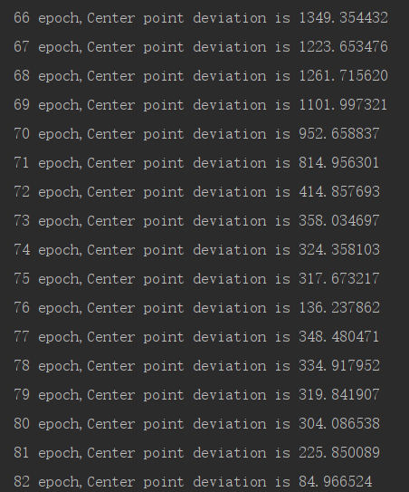

@[TOC](统计学习方法 第14章： 聚类方法)

github链接：[https://github.com/gdutthu/Statistical-learning-method](https://github.com/gdutthu/Statistical-learning-method)
知乎专栏链接：[https://zhuanlan.zhihu.com/c_1252919075576856576](https://zhuanlan.zhihu.com/c_1252919075576856576)


**算法总结：**

1、聚类的核心是相似度或距离；
2、聚合聚类的三要素:聚类或相似度、合并规则、停止条件；
3、k-means属于硬聚类方法，得到聚类结果是平坦的，非层次化的（通俗的理解，数据之间不存在上下关系）；
4、k-means算法是迭代算法，所得聚类结果与初始点密切相关，不能保证保证得到全局最优点。


**补充知识：**
1、硬聚类和软聚类；
2、聚合聚类的三要素。


# 1 基础知识
**聚类的核心是相似度或距离。** 因此在下面小节中我们对一些常见的距离公式和聚类方法的基础背景进行介绍。
## 1.1 距离公式
在knn算法中，我们也提到相应的距离公式。我们需要根据数据集间数据的相关特性进行选择合适的距离公式。

特征空间中两个实例点的距离就是两个实例的相似度。k近邻模型的空间一般是$n$维实数向量空间$\mathbf{R}^{n}$，**一般采用的距离是欧式距离。**

但是在实际数据集中，我们可以根据数据集的数据特点，选择不同的距离计算公式。设特征空间$\mathcal{X}$是$n$维实数向量空间$\mathbf{R}^{n}$，$x_{i}, x_{j} \in \mathcal{X}$，$x_{i}=\left(x_{i}^{(1)}, x_{i}^{(2)}, \cdots, x_{i}^{(n)}\right)^{\mathrm{T}}$，$x_{j}=\left(x_{j}^{(1)}, x_{j}^{(2)}, \cdots, x_{j}^{(n)}\right)^{\mathrm{T}}$，$x_{i}, x_{j}$的$L_{p}$距离（$L_{p}$距离也称为**闵科斯斯基距离**）定义为
$$L_{p}\left(x_{i}, x_{j}\right)=\left(\sum_{l=1}^{n}\left|x_{i}^{(l)}-x_{j}^{(l)}\right|^{p}\right)^{\frac{1}{p}}$$

其中$L_{p}$距离就是更加一般化定义的距离公式。我们可以根据数据集数据的特点，人为设定$p$（$p \geqslant 1$）的取值，从而使得knn模型能更好地进行分类或回归任务。
在下面，介绍几种常见的距离公式
1、当$p=2$时，称为欧氏距离（Euclidean distance），即
$$L_{2}\left(x_{i}, x_{j}\right)=\left(\sum_{l=1}^{n}\left|x_{i}^{(l)}-x_{j}^{(l)}\right|^{2}\right)^{\frac{1}{2}}$$
2、当$p=1$时，称为曼哈顿距离（Manhattan distance），即
$$L_{1}\left(x_{i}, x_{j}\right)=\sum_{l=1}^{n}\left|x_{i}^{(l)}-x_{j}^{(l)}\right|$$
3、当$p=\infty$时，称为切比雪夫距离（Chebyshev distance）它是各个坐标距离的最大值，即
$$L_{\infty}\left(x_{i}, x_{j}\right)=\max _{l}\left|x_{i}^{(l)}-x_{j}^{(l)}\right|$$
## 1.2 软、硬聚类
如果一个聚类方法假定一个样本只能属于一个类，或类的交集为空集，那么该方法称为**硬聚类**（hard clustering）方法。否则，如果一个样本可以属于多个类，或类的交集不为空集，那么该方法称为**软聚类**（soft  clustering）方法
## 1.3 三要素
聚合聚类需要预先确定下面三个要素：

 1. 距离或相似度；
 2. 合并条件；
 3. 停止条件。

根据这些概念的不同组合，就可以得到不同的聚类方法。


# 2 k均值聚类
给定$n$个样本的集合$X=(x_{1},x_{2},...,x_{n})$,每个样本由一个特征向量表示，特征向量的维数是$m$。$k$均值聚类的目标是将$n$个样本点分到$k$个不同的类或簇中，这里假设$k<n$。$k$个类$G_{1},G_{2},...,G_{k}$形成样本集合$X$的划分，其中$G_{i}\cap G_{j}=\varnothing$，$\cup_{i=1}^{k}{G_{i}}=X$。用$C$表示划分，一个划分对应一个聚类结果。


## 2.1 学习策略
kmeans所采用的距离公式为欧式距离平方（square Euclidean distance）作为样本之间的距离
$$\begin{aligned}
d(x_{i},x_{j})&= \sum_{k=1}^{m}(x_{ki}-x_{kj})^{2}\\
&=\|x_{i}-x_{j}\|^{2}
\end{aligned}$$
(注意，这里的k代表维度为m的两个向量之间对应位置相减，再开平方)

**定义样本与所属类的中心之间的距离的总和为损失函数**，即
$$W(C)= \sum_{l=1}^{k}\sum_{C(i)=l}\|x_{i}-\overline{x}_{l}\|^{2}$$
(注意，这里的$k$代表将$n$样本点k个类或簇)
$k$均值聚类就是求解最优化问题
$$\begin{aligned}
C^{*}&= argmin _{C}W(C)\\
&= argmin_{C} \sum_{l=1}^{k}\sum_{C(i)=l}\|x_{i}-\overline{x}_{l}\|^{2}
\end{aligned}$$
事实上，$k$均值聚类的最优解求解问题是$NP$困难问题。因此在现实中采用迭代取得方式进行求解。

## 2.2 迭代求解思路
具体的迭代求解过程如下：
首先，对于给定的中心值$(m_{1}，m_{2}，...,m_{l}，...,m_{k})$，求一个划分$C$，使得目标函数最小化
$$\begin{aligned}
 \min \limits_{C} \sum_{l=1}^{k}\sum_{C(i)=l}\|x_{i}-m_{l}\|^{2}
\end{aligned}$$
就是说在类中心确定的情况下，将每个样本分到一个类中，使样本和其所属类的中心之间的距离总和最小。求解结果，将每个样本指派到与其最近的中心$m_{l}$的类$G_{l}$中。

然后，对于给定的划分$C$，再求各个类的中心$(m_{1}，m_{2}，...,m_{l}，...,m_{k})$，使得目标函数极小化：
$$\begin{aligned}
 \min \limits_{m_{1}，m_{2}，...,m_{k}} \sum_{l=1}^{k}\sum_{C(i)=l}\|x_{i}-m_{l}\|^{2}
\end{aligned}$$
就是说在划分确定的情况下，使样本和其所属类的中心之间的距离最小。求解结果，对于每个包含$n_{l}$个样本的类$G_{l}$，更新其均值$m_{l}$：
$$\begin{aligned}
m_{l}=\frac{1}{n_{l}}\sum_{C(i)=l}x_{i},l=1,2,...,k
\end{aligned}$$
重复以上两个步骤，至到划分不再改变，得到聚类结果。
## 2.3 算法流程
输入：$n$个样本的集合$X$
输出：样本集合的聚类$C^{.}$
（1）初始化。令$t=0$，随机选择$k$个样本点作为初始聚类中心$m^{(0)}= (m_{1}^{(0)}，...,m_{l}^{(0)}，...,m_{k}^{(0)})$

（2）对样本进行聚类。对固定的类中心$m^{(t}= (m_{1}^{(t)}，...,m_{l}^{(t)}，...,m_{k}^{(t)})$，其中$m_{l}^{(t)}$为类$G_{l}$的中心，计算每个样本到类中心的距离，将每个样本指派到与其最近的中心的类中，构成聚类结果$C^{t}$

（3）计算新的类中心。对聚类结果$C^{(t)}$，计算当前各个类中的样本的均值，作为新的类中心$m^{(t+1)}= (m_{1}^{(t+1)}，...,m_{l}^{(t+1)}，...,m_{k}^{(t+1)})$

（4）如果迭代收敛或符合停止条件，输出$C^{*}=C^{t}$。
否则，令$t=t+1$，返回步（2）。


# 3 算法总结
kmeans有以下特点：
（1）类别数$k$预先指定；
（2）以欧式距离平方表示样本之间的距离或相似度，以中心或样本的均值表示类别；
（3）以样本和其所属类的中心之间的距离的总和为优化的目标函数；
（4）得到的类别是平坦的，非层次化的（通俗的理解，数据之间不存在上下关系）；
（5）算法是迭代算法，不能保证得到全局最优。

下图即可看出，kmeans方法的聚类结果并不能保证得到一个全局最优解。



# 4 代码附录
在这里采用mnist数据集进行kmeans聚类实验，采用TensorFlow2.0进行加载数据（懒得写函数加载模块了hhh）。在代码环节中，可以自己设定迭代次数的上限epoch和相邻两次迭代中中心点的偏差运行范围error。
```python
import tensorflow as tf
import  numpy as np
import random

# 加载训练mnist数据集的数据集和测试数据集
def MnistData():
    #原始的训练数据集是60000张尺寸为28*28的灰色照片，测试数据集是10000张尺寸为28*28的灰色照片
    mnist = tf.keras.datasets.mnist
    (train_data, train_label), (test_data, test_label) = mnist.load_data()
    train_data = train_data.reshape(60000, 784)
    test_data = test_data.reshape(10000, 784)
    #修改label的格式，默认格式为uint8，是不能显示负数的，将其修改为int8格式
    train_label=np.array(train_label,dtype='int8')
    test_label =np.array(test_label,dtype='int8')
    return (train_data, train_label), (test_data, test_label)

#kmaens模型
#input parameter:
# data：原始数据集
#k：聚类的类别总数，epoch：迭代训练次数的上限，error：中心点上下两轮的误差运行范围
#output parameter:
# center:返回聚类后各个类别的中心点坐标
def kmeans(data,k,epoch=3000,error=100):
    featureNum=data.shape[1]   #样本向量的特征维度
    classNum=k                 #人为预定的类别总数
    center=np.zeros(shape=(classNum,featureNum))  #定义类别中心点
    for i in range(classNum): #初始化类别中心点
        # 在数据集中随意选取一个点位类别中心点
        index=random.randint(0,data.shape[0]-1)
        center[i]=data[index]

    # 开始kmeans的迭代训练，迭代次数上限为epoch
    for i in range(epoch):
        centerFeatureCount=np.zeros(shape=(classNum,featureNum))   #记录每个类别的样本点特征向量的总和
        centerNumCount=np.zeros(classNum)   #记录每个类别的样本点的总个数
        for index in range(data.shape[0]):  #在一轮迭代过程中，遍历所有样本点
            #distance为样本点与不同类别中心点的距离
            #kmeans的距离为欧式距离平方
            distance=np.sum(np.square(data[index]-center),axis=1)
            curLable=np.argmin(distance)                #与其距离最小的中心点所属的类别就是该样本点的类别
            centerFeatureCount[curLable]+=data[index]   #记录该类别的样本点特征向量之和
            centerNumCount[curLable] +=1                #记录该类别的样本点个数
        #更新后中心点坐标
        nextCenter=np.zeros(shape=(classNum,featureNum))   #定义下一步的中心点坐标
        for j in range(classNum):   #每个类别的样本点求均值，得到下一轮迭代的中心点
            nextCenter[j]=centerFeatureCount[j]/centerNumCount[j]
        #相邻两轮的中心点偏差，并且打印出来
        nextError = np.sum(np.sum(np.abs(center - nextCenter), axis=1))
        print(' %d epoch,Center point deviation is %f ' % (i, nextError))
        #若中心点坐标变化较小时，停止迭代，否则继续进行下一轮迭代训练
        if nextError<error:
            break
        else:
            center=nextCenter
    return center

if __name__=="__main__":
    # 加载mnist数据集
    (train_data, train_label), (test_data, test_label) = MnistData()
    #用测试数据集进行kmeans距离
    center=kmeans(data=test_data,k=10)
```
从下图可以显然看出，$kmeans$迭代求解的过程中，中心点的变化偏差是逐渐变小的。但是，就如上面第2小节中分析的一样，$k$均值算法的聚类结果依赖于初始点的选择，并不能保证得到的是全局最优点。
