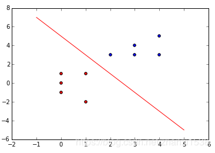



感知机（perceptron）是一个**二分类**的**线性二分类模型**，其输入为特征向量，输出为实例类别，为：+1和-1。感知机对应于输入空间（特征空间）中将实例划分为**正负两类的分类超平面。**
**总结：**

 1. 感知机是一个分类模型，并且只能进行二分类工作；
 2. 该模型是构建一个线性分类超平面进行分类，那么要求输入变量之间是满足线性关系；（对于非线性数据，可采用核函数+感知机，从而实现分类）
 3. 感知机模型的损失函数是所有误分类点到分类超平面的近似函数，并不是等值函数。
  4. 迭代训练过程是基于梯度下降方法（对于大型数据集，可采用随机梯度下降法）；

# 1 提出模型
**假设训练数据集是线性可分的，感知机学习的目标是求得一个能够将训练数据集正实例点和负实例点完全正确分开的线性分离超平面。**

注：如果是非线性可分的数据，则最后无法获得超平面。（可以通过核函数，将低维度空间上的非线性不可分数据，映射到高维度空间，将原数据变成高维度上的线性可分数据）

以二维空间为例，对于给定的数据点，我们希望能找到一个线性直线将这些样本点全部区分开。如下图所示

在前面我们提到，感知机的输出是实例类别，为：+1和-1。那么我们需要构建一个映射模型，将输入与输出连接起来
$$
f(x)=\operatorname{sign}(w \cdot x+b)
$$
那么在分类直线上方的样本点，输出为+1；在分类直线下方的样本点，输出为-1。其中

$$
\operatorname{sign}(x)=\left\{\begin{array}{ll}
+1, & x \geqslant 0 \\
-1, & x<0
\end{array}\right.
$$
**补充知识：超平面**
在日常中，我们所接触到物体是属于二维或者三维空间。那么当空间维度超过3时（不包括三维空间），所构建的平面方程就是超平面方程。如：
在平面方程$w^{T} x+b=0$中，$x=\left(x_{1}, x_{2}, \ldots, x_{d}\right)^{T}$
$w=\left(w_{1}, w_{2}, \ldots, w_{d}\right)^{T}$，若$d>3$，那么这个平面方程就是超平面方程。


# 2 算法模型
## 2.1 误分类点
大部分的机器学习算法的迭代训练都是建立在模型的损失函数。**模型训练者期望在迭代过程，算法模型的损失函数逐渐变小。** 感知机的损失函数是建立在模型误分类点上。
首先我们先来了解模型误分类点的定义。对于输入空间$R^n$ 任意一点$x_{0}$ 和分类超平面$S$

若点$x_{0}$被正确分类，即$(x_{0}，y_{0})$满足以下情类型

 - 若$w \cdot x_{i}+b>0$时，$y_{0}=+1$
 - 若$w \cdot x_{i}+b<0$时，$y_{0}=-1$

那么通过观察上面两式，我们可总结得到被感知机模型正确分类的样本点是满足$y_{0}.(w \cdot x_{i}+b)>0$。
那么反之可得，若点$x_{0}$被误分类，即$(x_{0}，y_{0})$满足以下情类型

 - 若$w \cdot x_{i}+b>0$时，$y_{0}=-1$
 - 若$w \cdot x_{i}+b<0$时，$y_{0}=+1$

那么通过观察上面两式，我们可总结得到被感知机模型误分类的样本点是满足：
$$
y_{0}.(w \cdot x_{i}+b)<0
$$
**补充知识：点到直线的距离**
在二维空间中，任意一点$(x_{0}，y_{0})$到直线$A x+B y+C=0$的距离为
$$
d=\frac{A x_{0}+B y_{0}+C}{\sqrt{A^{2}+B^{2}}}
$$
进一步将二维空间的距离公式拓展到$n$维空间，我们可以得到误分类点到分类超平面的距离为：

$$
\begin{aligned}
S_{i}&=\frac{1}{\|w\|}\left|w \cdot x_{0}+b\right|\\
&=-\frac{1}{\|w\|} \ y_{i}\left(w \cdot x_{i}+b\right)\\
\end{aligned}
$$


## 2.2 损失函数
感知机模型的损失函数是所有误分类点到分类超平面的总距离的**近似函数**。
假设分类超平面$S$的误分类点集合为$M$，那么所有误分类点到分类超平面的总距离为：
$$
\begin{aligned}
S=-\frac{1}{\|w\|} \sum_{x_{i} \in M} y_{i}\left(w \cdot x_{i}+b\right)\\
\end{aligned}
$$
**注意**
因为**感知机模型的最终目标是模型能正确分类全部样本点，也就是不存在误分类点（更加严谨的说法是，感知机学习算法是误分类驱动的）。** 那么此刻模型全部误分类点到分类超平面的距离为$S=0$
因为$\|w\|≠0$，此时满足
$$
\sum_{x_{i} \in M} y_{i}\left(w \cdot x_{i}+b\right)=0
$$
所以为了迭代训练的计算简便，我们将感知机模型的训练函数定义为：
$$
Loss(w, b)=-1*\sum_{x_{i} \in M} y_{i}\left(w \cdot x_{i}+b\right)
$$
对比于误分类点到分类超平面的总距离，损失函数$loss$不考虑 $\frac{1}{\|w\|}$。所以感知机模型的损失函数是误分类点到分类超平面的总距离$S$的**近似函数**。

## 2.3 梯度下降法
经过上一小节的推导，我们可知感知机模型的损失函数为
$$
Loss(w, b)=-1*\sum_{x_{i} \in M} y_{i}\left(w \cdot x_{i}+b\right)
$$
那么对于一个给定的数据集
$$
T=\left\{\left(x_{1}, y_{1}\right),\left(x_{2}, y_{2}\right), \cdots,\left(x_{N}, y_{N}\right)\right\}
$$
其中，$x_{i} \in \mathcal{X}=\mathbf{R}^{n}, y_{i} \in \mathcal{Y}=\{-1,1\}, i=1,2, \cdots, N$，解参数$w,b$的问题就可以转化为对损失函数求最小值的问题
$$
\min _{w, b}  Loss(w, b)=-\sum_{x_{i} \in M} y_{i}\left(w \cdot x_{i}+b\right)
$$
其中$M$是全部误分类点构成的集合。**在模型迭代训练中，我们采用梯度下降方法**（在大型数据集中，可以采用随机梯度下降方法）
损失函数$Loss(w, b)$对$w, b$的偏导数分别为：
$$
\nabla_{w} L(w, b)=-\sum_{x_{i} \in M} y_{i} x_{i}
$$

$$
\nabla_{b} L(w, b)=-\sum_{x_{i} \in M} y_{i}
$$


那么根据梯度下降法，随机选取一个误分类点，对参数$w, b$进行更新

其中，$x_{i} \in \mathcal{X}=\mathbf{R}^{n}, y_{i} \in \mathcal{Y}=\{-1,1\}, i=1,2, \cdots, N$，求解参数$w,b$的问题就可以转化为对损失函数求最小值的问题
$$\min _{w, b}  Loss(w, b)=-\sum_{x_{i} \in M} y_{i}\left(w \cdot x_{i}+b\right)$$

其中$M$是全部误分类点构成的集合。**在模型迭代训练中，我们采用梯度下降方法**（在大型数据集中，可以采用随机梯度下降方法）

式子中$\eta(0<\eta \leqslant 1)$是学习率$learning rate$（也称为步长）。这样通过不断的迭代训练，损失函数$Loss(w, b)$会逐渐减小至0。

# 3 算法步骤
（1）选取初值$w_{0},b_{0}$;
（2）在训练集中选取数据$(x_{i}，y_{i})$;
（3）如果$y_{i}\left(w \cdot x_{i}+b\right) \leqslant 0$,
$$
\begin{array}{l}
w \leftarrow w+\eta y_{i} x_{i}\\
b \leftarrow b+\eta y_{i}
\end{array}
$$
（4）转至（2），直到训练集中没有误分类点
在实际训练中，要实现第四步中的没有误分类点这一目标是较为困难的（训练成本过高）。
**那么当模型满足下面任一条件时，我们就认为所得到的模型已经是我们所需模型。**
1、损失函数$loss$小于一个较小数值$\varepsilon$（人为预先设定）；
2、模型训练迭代步数$epoch$已经到了人为预先设定的次数上限。


# 4 代码附录
在这里采用mnist数据中label=0和label=1的数据进行二分类实验，采用TensorFlow2.0进行加载数据（懒得写函数加载模块了hhh）。代码如下

**注意点：**
**TensorFlow加载进来的mnist数据集是uint8格式，不能显示负号，要将数据格式改成int8。**
其中在感知机模型中，需要对label数据进行修改值的操作，data部分不需要。故只需要对label部分数据集改格式。

```python
import  tensorflow as  tf
import numpy as np

# 加载训练mnist数据集的数据集和测试数据集
#因为感知机是二分类模型，故选取label=0和1的样本点，并且将label=0改成label=-1
def MnistData():
    #原始的训练数据集是60000张尺寸为28*28的灰色照片，测试数据集是10000张尺寸为28*28的灰色照片
    mnist = tf.keras.datasets.mnist
    (train_data, train_label), (test_data, test_label) = mnist.load_data()
    train_data = train_data.reshape(60000, 784)
    test_data = test_data.reshape(10000, 784)
    #提取出label=0和label=1的样本点
    train_data = train_data [np.where((train_label==0)  | (train_label== 1))]
    train_label = train_label[np.where((train_label==0) |  (train_label == 1))]
    test_data  = test_data[np.where((test_label == 0)  |  (test_label== 1))]
    test_label = test_label[np.where((test_label== 0)  |  (test_label == 1))]
    #修改label的格式，默认格式为uint8，是不能显示负数的，将其修改为int8格式
    train_label=np.array(train_label,dtype='int8')
    test_label =np.array(test_label,dtype='int8')
    #将label=0改成label=-1
    train_label[np.where(train_label== 0)] = -1
    test_label [np.where(test_label == 0)] = -1
    return (train_data, train_label), (test_data, test_label)

#采用随机梯度下降方法，训练感知机模型
#epoch：迭代次数上限,learnRate:学习率
def perceptron(train_data,train_label,test_data, test_label,epoch=3000,learnRate=0.5):
    w=np.random.rand(1,784)  #初始化模型参数
    b=np.random.rand(1)
    for i in range(epoch):   #开始迭代训练，迭代次数上限是epoch
        for j in range(len(train_label)): #遍历数据集
            if train_label[j] * (np.dot(train_data[j], w.T) + b) < 0:  # 检测到误分类点
                w_grad=-train_label[j]*train_data[j]  #损失函数对w，b参数的偏导数
                b_grad=-train_label[j]
                w=w-learnRate*w_grad   #更新w，b参数
                b=b-learnRate*b_grad
        if i %100==0:   #每迭代训练一百次，就打印模型的分类准确率
            acc=modelTest(test_data, test_label,w,b)
            print(' %d epoch,model accuracy is %f: '%(i,acc))
    return w,b

#测试模型
def modelTest(test_data, test_label,w,b):
    acc=0   #记录测试集中分类准确点的数量
    for i in range(len(test_label)):
        if test_label[i]*(np.dot(test_data[i],w.T)+b)>0:  #检测到模型的分类准确点
            acc=acc+1
    return acc/len(test_label) * 100


if __name__=="__main__":
    start=time.time()
    # 加载mnist数据集中label=0和label=+1的数据，并且将label=0改成label=-1
    (train_data, train_label), (test_data, test_label)=MnistData()
    #训练模型
    w,b=perceptron(train_data, train_label, test_data, test_label)
```

