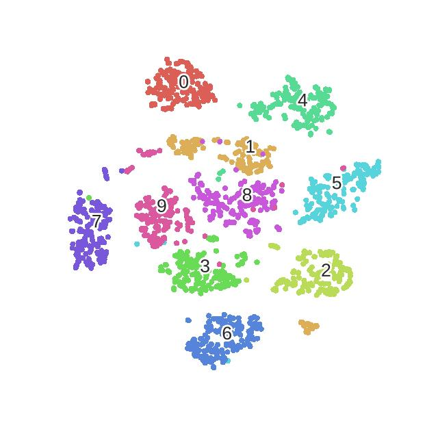
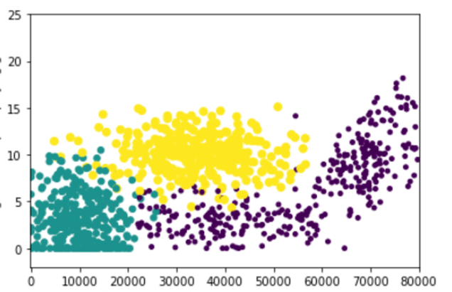
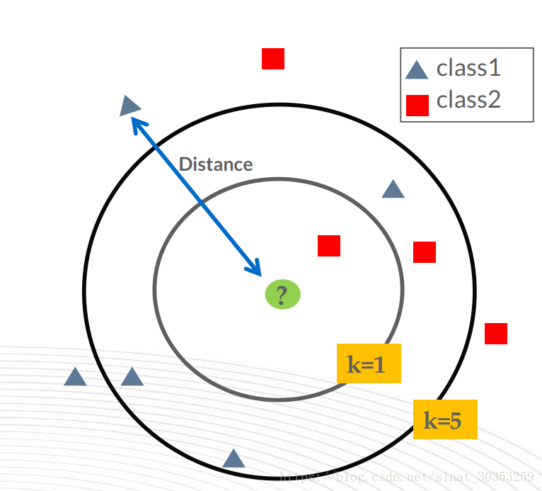

**算法总结：**

 1. knn模型不需要预训练。
 2. k近邻法的三要素：k值的选择、距离度量以及分类决策规则。
 3.  k近邻法即能处理分类问题，也能解决回归问题。

**补充知识**

 1. 近似误差、估计误差

# 1 提出模型
在上一小节的感知机模型，我们通过寻找一个线性分类超平面来将**两个线性可分的数据**相互分开。

在实际的数据处理中，当所需要处理的数据存在以下特性是

 1. 数据集中数据的种类超过2。
 2. 数据间的关系是非线性甚至数据间不存在关系。

以下图为例，下图为实际流水线中某工艺产品的实际数据。数据类别总数是10，从0至9.其中类别为0为合格产品，类别1至9为不合格产品，并且每个类别代表了不同的产品不合格原因。
现在给你一个产品，需要你判断这个产品是否是合格产品；如果不合格，那么请你给出该产品不合格的原因。

那么在knn中，是怎么进行样本的分类问题呢。
1.**找到样本x最近的点，该点的类就是样本的预测类。**这是一种方法，但是如果有噪音呢（这个输入实例恰巧在两个类别的分界处）

2.**与每一团的中心点进行距离计算。**分别计算各个类别的中心点，判断与该样本点距离最小的类即为预测输出类。这样会不会有问题吗？我们看一下上图中绿色和紫色交叉的地方，很明显在这个交叉位置离绿色很近，与紫色中心点较远，但实际上紫色的。所以…..不太好


3.**找到样本点周围的K个点，其中占数目最多的类即预测输出的类。**克服了前两种方法的弊端，实际上这就是K近邻所使用的算法


# 2 knn三要素
## 2.1 距离度量
特征空间中两个实例点的距离就是两个实例的相似度。k近邻模型的空间一般是$n$维实数向量空间$\mathbf{R}^{n}$，**一般采用的距离是欧式距离。**
但是在实际数据集中，我们可以根据数据集的数据特点，选择不同的距离计算公式。设特征空间$\mathcal{X}$是$n$维实数向量空间$\mathbf{R}^{n}$，$x_{i}, x_{j} \in \mathcal{X}$，$x_{i}=\left(x_{i}^{(1)}, x_{i}^{(2)}, \cdots, x_{i}^{(n)}\right)^{\mathrm{T}}$，$x_{j}=\left(x_{j}^{(1)}, x_{j}^{(2)}, \cdots, x_{j}^{(n)}\right)^{\mathrm{T}}$，$x_{i}, x_{j}$的$L_{p}$距离定义为
$$L_{p}\left(x_{i}, x_{j}\right)=\left(\sum_{l=1}^{n}\left|x_{i}^{(l)}-x_{j}^{(l)}\right|^{p}\right)^{\frac{1}{p}}$$

其中$L_{p}$距离就是更加一般化定义的距离公式。我们可以根据数据集数据的特点，人为设定$p$（$p \geqslant 1$）的取值，从而使得knn模型能更好地进行分类或回归任务。
在下面，介绍几种常见的距离公式
1、当$p=2$时，称为欧氏距离（Euclidean distance），即
$$L_{2}\left(x_{i}, x_{j}\right)=\left(\sum_{l=1}^{n}\left|x_{i}^{(l)}-x_{j}^{(l)}\right|^{2}\right)^{\frac{1}{2}}$$
2、当$p=1$时，称为曼哈顿距离（Manhattan distance），即
$$L_{1}\left(x_{i}, x_{j}\right)=\sum_{l=1}^{n}\left|x_{i}^{(l)}-x_{j}^{(l)}\right|$$
3、当$p=\infty$时，它是各个坐标距离的最大值，即
$$L_{\infty}\left(x_{i}, x_{j}\right)=\max _{l}\left|x_{i}^{(l)}-x_{j}^{(l)}\right|$$


## 2.2 k值的选择
 k值的选择对k近邻法的结果会产生重大影响。如下图，当k=1时，输入点就被预测为class2；当k=5时，输入点就被预测为class1。

**补充知识：近似误差与估计误差**

 - 近似误差：可以理解为对现有训练集的训练误差。 
 - 估计误差：可以理解为对测试集的测试误差。

近似误差关注训练集，如果近似误差小了会出现过拟合的现象，对现有的训练集能有很好的预测，但是对未知的测试样本将会出现较大偏差的预测。模型本身不是最接近最佳模型。

估计误差关注测试集，估计误差小了说明对未知数据的预测能力好。模型本身最接近最佳模型。

**总结**

 1. 预测结果好，估计误差小 。
 2. 模型容易过拟合，近似误差小。

**k值选取对模型的影响**
一、如果选择较小的k值，就相当于用较小的邻域的训练实例进行预测
**优点：** **学习的近似误差会变小，** 只有与输入实例较劲（相似的）训练实例才会对预测结果起作用。

**缺点：** **学习的估计误差会变大，预测结果对近邻的实例点非常敏感**，如果领近的实例点恰巧是噪声，那么预测就会变错。（也就是，k值的减小就意味着模型变得复杂，**容易发生过拟合**）


二、如果选择较大的k值，就相当于用较大的邻域的训练实例进行预测
**优点：** **学习的估计误差会变小，预测结果对近邻的实例点非常敏感**预测效果好

**缺点：** **学习的近似误差会变大，** 这时离输入点较远的点（不相似的）训练实例也会对预测起作用。

在实际应用中，通常要采用交叉验证的方法来选取最优的k值。（**k一般选取一个较小的数值，不要超过20**）
## 2.3 决策标准
k近邻法的分类决策往往就是多数表决，即由输入实例的k个领近的训练实例的多数类决定输入实例的类

# 3 kd树
以后再补
# 4 代码附录
在这里采用mnist数据集进行k近邻法多分类实验，采用TensorFlow2.0进行加载数据（懒得写函数加载模块了hhh）。在代码环节中，对测试集中的所有实例点都进行了测试，所需时间较长。如果想要测试部分样本点，稍微修改下代码即可。
**注意点：**
**TensorFlow加载进来的mnist数据集是uint8格式，不能显示负号，要将数据格式改成int32。**
其中在knn模型中，需要对data数据进行距离计算，label部分不需要显示符合。故只需要对data部分数据集改格式。

**4.1 原始knn算法，未包含kd tree模块**

```python
import tensorflow as  tf
import numpy as np

# 加载训练mnist数据集的数据集和测试数据集
def MnistData():
    #原始的训练数据集是60000张尺寸为28*28的灰色照片，测试数据集是10000张尺寸为28*28的灰色照片
    mnist = tf.keras.datasets.mnist
    (train_data, train_label), (test_data, test_label) = mnist.load_data()
    train_data = train_data.reshape(60000, 784)
    test_data = test_data.reshape(10000, 784)
    #修改label的格式，默认格式为uint8，是不能显示负数的，将其修改为int32格式
    train_data=np.array(train_data,dtype='int32')
    test_data =np.array(test_data,dtype='int32')
    return (train_data, train_label), (test_data, test_label)

#knn算法（不包括kd树）
def knn(train_data,train_label,test_data, test_label,k):
    count=0  #记录knn模型预测成功的次数
    for i in range(test_data.shape[0]):      #对测试集每个实例点都进行knn算法处理
        # 计测测试集输入点与训练数据集所有点的算欧式距离
       distance=np.sqrt(np.sum(np.square(test_data[i] - train_data),axis=1))
       #np.argsort函数返回的是数组中数组值从小到大对应的索引值
       index=np.argsort(distance) #argsort(distance)是将所计算得到距离从小到大排列，提取其对应的索引
       selectIndex=index[:k]                    #选取出与当前输入点距离最小的前k个的实例点对应的索引
       classNumber=len(np.unique(train_label))  #出重处理，得到train_label所存在不同的元素的数量
       labelList=[0]*classNumber                #初始化列表,计算不同label出现的次数
       for j in selectIndex:   #记录train_label在selectIndex索引对应的label出现的次数
           # train_label[j]：selectIndex当前索引在训练数据集中对应的种类
           labelList[train_label[j]] +=1
       # np.argmax(labelList),找到出现次数最多的种类对应的索引（索引是0到9，对应不同的种类）
       predict=np.argmax(labelList)   #出现次数最多的种类，等同于预测的种类
       if predict ==test_label[i]:
           count +=1
       if i %100==0 and i!=0:     #每预测一百次，就打印当前时刻模型的预测准确率
            acc=count/i
            print(' %d epoch,model accuracy is %f: '%(i,acc))
if __name__=="__main__":
    # 加载mnist数据集
    (train_data, train_label), (test_data, test_label)=MnistData()
    #knn模型
    knn(train_data,train_label,test_data, test_label,k=25)
```
**knn算法，未包含kd tree模块**

```python
代码待补充
```

