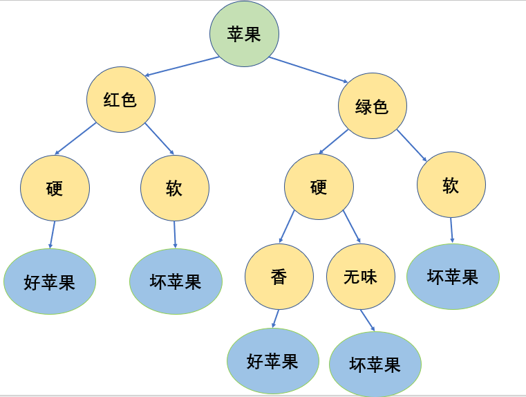
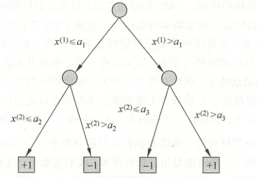

@[TOC](统计学习方法 第5章：决策树)

github链接：[https://github.com/gdutthu/Statistical-learning-method](https://github.com/gdutthu/Statistical-learning-method)
知乎专栏链接：[https://zhuanlan.zhihu.com/c_1252919075576856576](https://zhuanlan.zhihu.com/c_1252919075576856576)
# 1 提出模型
在对决策树模型进行讲解前，我们先来看一个简单的例子。我们收集到下面数据。从下表可看出，苹果的好坏和它的颜色、硬度、香味密切相关。
| 苹果序号 | 颜色 | 硬度 |香味 |结论 |
| :-: | :-: | :-:  | :-:  | :-:  |
| 1| 红色| 硬 |香| 好苹果 |
|2 | 红色 | 硬 |无味| 好苹果 |
| 3| 红色 | 软|无味| 坏苹果 |
| 4| 绿色| 硬 |香| 好苹果 |
| 5 | 绿色 | 硬 |无味| 坏苹果 |
| 6 | 绿色 | 软 |无味| 坏苹果 |

那么基于上面的表格，我们可以画出下面这样苹果好坏的判断模型。



这就是决策树的模型，它通过对大量训练样本的学习去建立一个决策树，依次判断每个属性，从而判断该样本的标记。我们可以这样画个图。每次拿到一个苹果就从最顶上开始依次往下判断，最后得出结论。


# 2 学习策略
通过上一小节的例子，我们可以直观的看出决策树模型是怎样对一个测试样本进行判断的。那么在这一小节中，我们将来学习怎样建立一个决策树模型。
## 2.1 决策树模型
用决策树分类，从根节点开始，对实例的某一特征进行测试，根据测试结果，将实例分配到其子节点；这时，每一个子节点对应着该特征的一个取值。如此递归地对实例进行测试并分配，直到到达叶节点。最终将实例分到叶节点的类中。



上图看成一个决策树模型示意图，其中途中的圆框和方框分别表示内部节点（internal node）和叶节点（leaf node）。内部节点表示一个特征或属性，叶节点表示一个类。

##  2.2 模型规则
**决策树模型可看成大量的 $if-then$规则的集合**。 个人觉得在决策树构建这块，李航博士的《统计学习方法》讲的已经很详细了。那么在这里，只是将下面算法中需要用到的公式摘录出来。

 - **随机变量的熵$H(p)$**

设$X$是一个取有限个值得离散随机量，其概率分布为
$$P(X=x_{i})=p_{i},i=1,2,...,n$$
将随机变量$X$的熵$H(p)$定义为：
$$H(p)=-\sum_{i=1}^{n} p_{i} \log p_{i}$$

值得注意的是
1、熵$H(p)$只与$X$的分布有关，而与$X$的取值无光；
2、熵越大，随机变量的不确定性越大。并且从熵的定义可看出：
$$0 \leq H(p) \leq \log n$$
3、$\log$函数的底数可以是2也可以是$e$,一般是选择2为底数。

举个例子，以上述表格中苹果的好坏为例。从表格可看出6个苹果中有3个好苹果，有3个坏苹果。定于变量$X=\{x_{1},x_{2}\}$，其中$x_{1},x_{2}$分别表示好苹果和坏苹果。那么该变量的熵为：
$$
\begin{aligned}
H(p)&=-\sum_{i=1}^{2}{p(x_{i})* \log p(x_{i})}\\
&=-1*(p(x_{1})* \log p(x_{1})+p(x_{2})* \log p(x_{2}))\\
&=-1*(\frac{1}{2}\log \frac{1}{2}+\frac{1}{2}\log \frac{1}{2})=0.69
 \end{aligned}
$$
在这里，我们将$\log$函数的底数选为$e$

 - **经验熵$H(Y \mid X)$**

经验熵$H(Y | X)$表示在已知随机变量$X$的条件下随机变量$Y$的不确定性。随机变量$X$给定的条件下随机变量$Y$的条件熵$H(Y | X)$，定义为$X$给定条件下$Y$的条件概率分布的熵对$X$的数学期望
$$H(Y \mid X)=\sum_{i=1}^{n} p_{i} H\left(Y \mid X=x_{i}\right)$$
这里，$p_{i}=P(X=x_{i}) ,i=1,2,...,n$

接着上述的例子，将苹果的香味定义为变量$Y=\{y_{1},y_{2}\}$，其中$y_{1},y_{2}$分别表示有香味和无香味。从表格可看出，3个好苹果中有2个苹果有香味，1个苹果无香味；3个坏苹果均为无香味。

$$\begin{aligned}
H(Y \mid X=x_{1})&=-\sum_{j=1}^{2}p(y_{i},x_{1})*\log p(y_{i},x_{1}) \\
&=-1*(\frac{2}{3}*\log \frac{2}{3}+\frac{1}{3}*\log \frac{1}{3})=0.6365
 \end{aligned}$$

$$\begin{aligned}
H(Y \mid X=x_{2})&=-\sum_{j=1}^{2}p(y_{i},x_{2})*\log 
p(y_{i},x_{2}) \\
&=-1*(0+1*\log 1)=0
 \end{aligned}$$
则
$$H(Y \mid X)=H(Y \mid X=x_{1})+H(Y \mid X=x_{2})=0.6365$$

 - **信息增益$g(D, A)$**

**信息增益 表示特征$X$的信息而使得类$Y$的信息$Y$的信息的不确定性减少的程度。** 特征$A$对训练数据集$D$的信息增益$g(D, A)$，定义为集合$D$的的经验熵$H(D)$与特征$A$给定条件下$D$的经验条件熵$H(D \mid A)$之差，即


$$g(D, A)=H(D)-H(D \mid A) $$

继续接着上面两个例子进行讲解。得到苹果的香味这一特征对苹果好坏的信息增益为：
$$g(D, A)=H(D)-H(D \mid A) =0.69-0.6365=0.0535$$

##  2.3 信息增益的算法

输入：训练数据集$D$和特征$A$
输出：特征$A$对训练数据集$D$的信息增益 g(D, A)
（1）计算数据集$D$的经验熵
$$H(D)=-\sum_{k=1}^{K} \frac{\left|C_{k}\right|}{|D|} \log _{2} \frac{\left|C_{k}\right|}{|D|}$$
（2）计算特征$A$对数据集$D$的经验熵$H(D \mid A)$
$$H(D \mid A)=\sum_{i=1}^{n} \frac{\left|D_{i}\right|}{|D|} H\left(D_{i}\right)=-\sum_{i=1}^{n} \frac{\left|D_{i}\right|}{|D|} \sum_{k=1}^{K} \frac{\left|D_{i k}\right|}{\left|D_{i}\right|} \log _{2} \frac{\left|D_{i k}\right|}{\left|D_{i}\right|}$$
（3）计算信息增益
$$g(D, A)=H(D)-H(D \mid A) $$

# 3 算法流程
第四小节的决策树代码采用的是ID3算法。

**输入：** 训练数据集$D$，特征集$A$阈值$\xi$;
**输出：** 决策树$T$。

 1. 若$D$中所有实例属于同一类$C_{k}$，则$T$为单结点树，并将类$C_{k}$作为该节点的类标记，返回$T$；
 2. 若$A=\varnothing$，则$T$为单节点树，并将$D$中实例数最大的类$C_{k}$作为该节点的类标记，返回$T$；
  3. 否则，计算特征集$A$中各特征对$D$的信息增益，选择增益最大的特征$A_{g}$;如果$A_{g}$的信息增益小于阈值$\xi$，则置$T$为单节点树，并将$D$中实例数最大的类$C_{k}$作为该结点的类标记，返回$T$；
 4. 否则，对$A_{g}$的每一个可能值$\alpha_{i}$，依$A_{g}=\alpha_{i}$将$D$分割为若干子集$D_{i}$，将$D_{i}$中实例最大的类作为标记，构建子节点，由节点及其子节点构成数$T$，返回$T$；
 5. 对第$i$个子节点，以$D_{i}$为训练集，以$A-A_{g}$为特征集，递归调用（1）~（5）步，得到子树$T_{i}$,返回$T_{i}$。

# 4 代码附录

在这里采用mnist数据中进行多分类实验，采用TensorFlow2.0进行加载数据（懒得写函数加载模块了hhh）。为了二叉树模型的简便性（数值太多，笔记本训练起来耗时太长），对像素值做0~1处理，像素值大于255/2的令其为1，反之为0。模型预测的错误率： 12.76％。代码如下：


```python
import  tensorflow as  tf
import numpy as np
import copy

#加载训练mnist数据集的数据集和测试数据集
def MnistData():
    #原始的训练数据集是60000张尺寸为28*28的灰色照片，测试数据集是10000张尺寸为28*28的灰色照片
    mnist = tf.keras.datasets.mnist
    (train_data, train_label), (test_data, test_label) = mnist.load_data()
    train_data = train_data.reshape(60000, 784)
    test_data = test_data.reshape(10000, 784)

    #图像色素点数据在0~255之间
    #为了二叉树模型的简便性，对像素值做0~1处理，像素值大于255/2的令其为1，反之为0
    train_data[train_data < 255 / 2] = 0
    train_data[train_data >= 255/2]  = 1
    test_data[test_data < 255 / 2]   = 0
    test_data[test_data   >= 255/2]  = 1
    return (train_data, train_label), (test_data, test_label)

#函数功能：找到当前标签集中占数目最大的标签
def majorLabelClass(label):
   labelClass=np.unique(label)                               #对原始标签数据进行去重,得到label所有可能的取值，并且数值是升序排序
   labelClassNum=np.zeros(len(labelClass))                   #初始化0矩阵，用来记录每个类别标签出现的次数
   for index in range(len(labelClass)):                      #遍历label所有可能的取值,即val=labelClass[index]
       val=labelClass[index]
       labelSubSet=label[np.where(label==val)]               #提取出标签数据集中label==val的数据，构成子数据集
       labelClassNum[index]=len(labelSubSet)
   maxValueIndex=np.argmax(labelClassNum)                    #出现次数最多类别的下标,，对应着标签的取值
   return labelClass[maxValueIndex]                          #返回出现次数最多的label类别

#函数功能：计算数据集的经验熵
#参考公式：李航《统计学习方法》第二版 公式5.7
#参数说明：label：训练数据集的标签数据集
def calculation_H_D(label):
    labelClass = np.unique(label)                      #对原始标签数据进行去重,得到label所有可能的取值，并且数值是升序排序
    HD=0                                               #初始化数据集的经验熵
    for labelValue in labelClass:                      #遍历label所有可能的取值
        subLabelSet=label[np.where(label==labelValue)] #提取出标签数据集中label==labelValue的数据，构成子数据集
        prob=len(subLabelSet)/len(label)               #该子集所占比例
        HD +=(-1)*prob*np.log2(prob)
    return HD

#函数功能：计算经验条件熵
#参考公式：李航《统计学习方法》第二版 公式5.8
#参数说明：trainDataFeature:训练数据集被提取出的的一列特征数据，label：训练数据集的标签数据集
def calculation_H_D_A(trainDataFeature,label):
    dataValueClass = np.unique(trainDataFeature)                           #对特征数据进行去重,得到当前特征维度下特征向量所有可能的取值
    HDA=0                                                                  #初始化当前特征维度的经验条件熵
    for dataValue in dataValueClass:                                       #遍历特征维度所有可能的取值
        subDatalSet=trainDataFeature[np.where(trainDataFeature==dataValue)]#把特征维度中等于dataValue的数据全部提取出来
        subLabelSet = label[np.where(trainDataFeature == dataValue)]       #把上述子数据集对应的标签数据集提取出来
        prob=len(subDatalSet)/len(trainDataFeature)                        #该子集所占比例
        HDA +=prob*calculation_H_D(subLabelSet)
    return HDA

#函数功能：得到最佳的特征维度
#基本思路：最佳的特征划分维度就是条件经验熵最大的特征维度
#参考公式：李航《统计学习方法》第二版 公式5.9
def calcBestFeature(trainData, trainLabel):
    featureNum=trainData.shape[1]               #特征维度的数量
    informationGain=np.zeros(featureNum)        #初始化0矩阵，记录每一个特征维度的信息增益
    dataHD=calculation_H_D(trainLabel)          #数据集的经验熵
    for featureIndex in range(featureNum):      #计算每个特征维度的信息增益
        informationGain[featureIndex]=dataHD-calculation_H_D_A(trainData[:,featureIndex],trainLabel)
    maxInformationGainIndex = np.argmax(informationGain)            #信息增益最大的特征维度的下标
    maxInformationGain = informationGain[maxInformationGainIndex]   #获取最大的信息增益
    return  maxInformationGainIndex,maxInformationGain              #返回信息增益最大的特征向量下标、以及此时的信息增益


#函数功能：更新数据集和标签集，删除掉数据集中特征索引为featureIndex的特征维度数据
#参数说明：
# trainData:要更新的原始数据集
# trainLabel: 要更新的原始标签集
# featureIndex: 要去除的特征索引
# a:data[A]== a时，说明该行样本时要保留的样本数据
def getSubDataArr(trainData, trainLabel,featureIndex, a):
    newLabel=trainLabel[np.where(trainData[:,featureIndex]==a)]  #提取出data[：,A]== a的训练数据和标签数据
    newData=trainData[np.where(trainData[:,featureIndex]==a)]
    np.delete(arr=newData,obj=featureIndex,axis=1)               #删除featureIndex对应的特征维度
    return (newData, newLabel)                                   #返回更新后的数据集和标签集

#函数功能：训练决策树模型
#基本思路：采用ID3算法,参考李航《统计学习方法》第二版 算法5.2
#参数说明：dataSet=(train_data, train_label)，为元组结构
#Epsilon:信息增益的阈值
def createTree(dataSet,epsilon=0.05):
    trainData=dataSet[0]
    trainLabel=dataSet[1]

    #数据集为空集时，特征维度已经无法再进行划分，就返回占大多数的类别
    if trainData.shape[1]==0:
        return majorLabelClass(trainLabel)

    labelClass=np.unique(trainLabel)               #对特征数据进行去重,得到当前特征维度下特征向量所有可能的取值
    labelClassNum=np.zeros(len(labelClass))        #初始化0矩阵，用来记录每个label出现的次数

    if len(labelClass) == 1:                       #数据集中只有一个类别时，此时不需要再分化
        return  labelClass[0].astype(np.int8)      #返回标记作为该节点的值，返回后这就是一个叶子节点


    for index in range(len(labelClass)):            #遍历标签数据集所有可能的取值计算每个类别出现的次数
        val=labelClass[index]
        labelSet=trainLabel[trainLabel==val]        #统计每个类别出现的次数
        labelClassNum[index]=len(labelSet)

    #计算出当前信息最大的信息增益对应的特征维度
    #参数说明：Ag：特征维度的下标索引，EpsilonGet：对应的信息增益
    Ag, EpsilonGet = calcBestFeature(trainData, trainLabel)

    # 如果Ag的信息增益比小于阈值Epsilon，则置T为单节点树，并将D中实例数最大的类Ck
    # 作为该节点的类，返回T
    if EpsilonGet<epsilon:
        return  majorLabelClass(trainLabel)

    #否则，对Ag的每一可能值ai，依Ag=ai将D分割为若干非空子集Di，将Di中实例数最大的
    #类作为标记，构建子节点，由节点及其子节点构成树T，返回T
    #在数据预处理对数据做过二值化处理，Ag的可能取值ai要么为0，要么为1
    treeDict = {Ag:{}}

    # 函数说明：getSubDataArr(trainDataList, trainLabelList, Ag, 0)
    # 在当前数据集中删除掉当前的feature，返回新的数据集和标签集
    treeDict[Ag][0] = createTree(getSubDataArr(trainData, trainLabel, Ag, 0))
    treeDict[Ag][1] = createTree(getSubDataArr(trainData, trainLabel, Ag, 1))
    return treeDict

#函数功能：基于所得到的决策树模型，对样本的标签进行预测
#参数说明：testSample：测试样本，tree：决策树模型
def labelPredict(testSample,treeModel):
    tree=copy.copy(treeModel)      #复制树模型，防止下面树节点的移动会覆盖原模型
    while True:
        # 获取树模型最顶层的key、value
        #在这个程序中，key代表的是当前节点，value对应的是下一节点或者标签类别
        (key, value), = tree.items()                 #不加逗号会运行错误，不知道啥原因

        if type(tree[key]).__name__ == 'dict':       #如果当前的value是字典，说明还需要遍历下去
            dataVal =testSample[key]                 #提取出测试样本在该特征维度的数值，取值为0或1
            np.delete(arr=testSample,obj=key)        #去除掉测试样本在该特征维度的数值
            tree=tree[key][dataVal]                  #树节点向下移动
            if type(tree).__name__ != 'dict':        #树节点移动到了叶子节点，返回该节点值，也就是分类值
                return tree
        else:                                        #如果当前value不是字典，那就返回分类值
            return tree[key]

#函数说明：决策树模型测试函数
def modelTest(test_data, test_label,tree):
    errorCount = 0                                   #计数器，记录模型预测错误的次数
    for index in range(len(test_label)):
        predict=labelPredict(test_data[index],tree)  #树模型对该样本数据的标签预测值
        if predict !=test_label[index]:              #预测得到的标签与真实标签不一致时，计数器加一
            errorCount=errorCount+1
    # 返回准确率
    print("模型预测的错误率：",errorCount/len(test_label))

if __name__=="__main__":
    # 加载mnist数据集中label=0和label=+1的数据，并且将label=0改成label=-1
    print("开始加载数据")
    (train_data, train_label), (test_data, test_label)=MnistData()
    print("数据加载结束")

    #训练决策树模型
    print("开始训练模型")
    dataSet=(train_data, train_label)       #将训练数据集合标签和标签数据集组合构成元组类型
    tree=createTree((dataSet))
    print(tree)
    print("结束训练模型")

    print("开始测试模型")
    modelTest(test_data, test_label, tree)
    print("结束测试模型")

```

