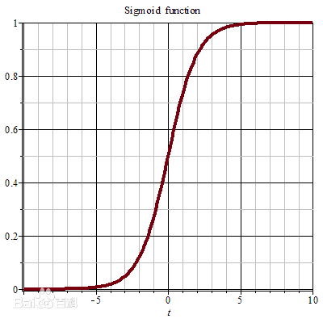
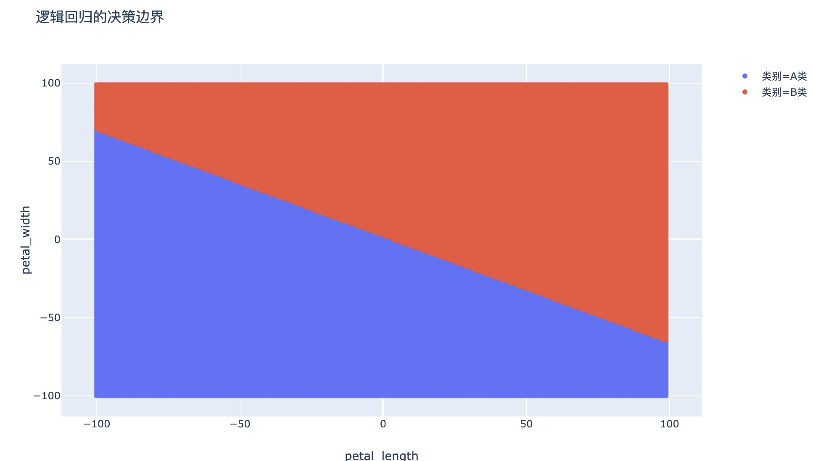
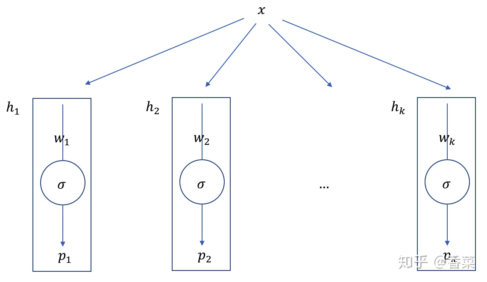

@[TOC](统计学习方法 第6章：逻辑斯蒂回归)

github链接：[https://github.com/gdutthu/Statistical-learning-method](https://github.com/gdutthu/Statistical-learning-method)
知乎专栏链接：[https://zhuanlan.zhihu.com/c_1252919075576856576](https://zhuanlan.zhihu.com/c_1252919075576856576)

**算法总结：**
1、对比感知机模型，logistics不不仅能进行分类，还能计算出样本点属于每个类别的概率；
2、logistics和最大熵模型都是对数线性模型（一般而言，logistics被认为是广义线性模型）。
3、普通的logistic回归只能针对二分类问题。要要实现多分类，需要对原始logistic回归进行修改。（一般而言是引入softmax函数）；


**补充知识：**
1、sigmoid函数；
2、OvR 与 OvO。


# 1 提出模型
**感知机模型和传统的logistics模型都是线性二分类模型**，都是期望找到一个线性决策边界从而将两种不同类别的数据区分开。这两个算法具有一定的相似性。
**在感知机模型中，我们可通过梯度下降方法来学习模型参数，最终找到一个线性超平面 $w^{T}x+b=0$ 将两种线性可分数据区分开。** 

**但是在感知机我们只能得到最终的划分结果，并不知道样本点属于各个类别的概率。** 若样本点A和样本点B同时被模型$f$判断为正样本。但是实际上样本点A为正样本的概率为0.91，样本点B为正样本的概率为0.56。那么相比于样本点B，样本A属于正样本类别的信息更多一些，我们也希望获得这方面的信息。因此提出了logistics模型。

为了计算样本点属于各个类别的概率，我们引入了sigmoid函数。将感知机分类超平面的输入映射到[0,1]区间。
sigmoid是一个S型函数，它的表达式为$\sigma(x)=\frac{1}{1+e^{-x}}$，函数图像分别如下


**补充知识：sigmoid函数的特点**
1、定义域为$(-\infty,+\infty)$，值域为$(0,1)$。
（能满足超平面各式各样的输入，将其和概率区间对应起来）
2、    函数对输入超过一定范围就会不敏感；
3、sigmoid函数的导数
$$\begin{aligned}
f^{\prime}(z) &=\left(\frac{1}{1+e^{-z}}\right)^{\prime} \\
&=\frac{e^{-z}}{\left(1+e^{-z}\right)^{2}} \\
&=\frac{1+e^{-z}-1}{\left(1+e^{-z}\right)^{2}} \\
&=\frac{1}{\left(1+e^{-z}\right)}\left(1-\frac{1}{\left(1+e^{-z}\right)}\right) \\
&=f(z)(1-f(z))
\end{aligned}$$


**4、在定义域内为连续和光滑函数。**
（这点最为重要，这满足梯度下降法的使用前提）
**5、因为逻辑回归的损失函数L是一个连续的凸函数（conveniently convex）。这样的函数的特征是，它只会有一个全局最优的点，不存在局部最优。**

我们结合sigmoid函数和线性回归函数，把线性回归模型的输出作为sigmoid函数的输入。于是最后就变成了逻辑回归模型：
$$y=\sigma(f(\boldsymbol{x}))=\sigma\left(\boldsymbol{w}^{T} \boldsymbol{x}+b\right)=\frac{1}{1+e^{-(\boldsymbol{w}^{T} \boldsymbol{x}+b)}}$$
假设我们已经训练好了一组权值 $w,b$ 。只要把需要预测样本点A的特征向量$x$ 代入到上面的方程，输出的y值就是这个标签为A的概率，我们就能够判断输入数据是属于哪个类别。


假设只有两个标签1和0，$y_{n} \in\{0,1\}$，我们把采集到的任何一组样本看做一个事件的话，那么这个事件发生的概率假设为$p$。我们的模型y的值等于标签为0的概率也就是$p$。则y的值等于标签为1的概率也就是$1-p$

$$\begin{array}{l}
P(Y=1| x)=\frac{1}{1+\exp (-w \cdot x)}\\
P(Y=0| x)=1-P(Y=1| x)=\frac{\exp (-w \cdot x+b)}{1+\exp (-w \cdot x+b)} \\
\end{array}$$
我们把单个样本看做一个事件，那么这个事件发生的概率就是
$$P(y | \boldsymbol{x})=\left\{\begin{array}{r}
p, y=1 \\
1-p, y=0\\
\end{array}\right.$$

为了符号简单的，对权值向量和输入向量进行扩充。即将原先的$x_{i}=(x_{i}^{(1)},x_{i}^{(2)},x_{i}^{(3)},...,x_{i}^{(n)})$,$w_{i}=(w_{i}^{(1)},w_{i}^{(2)},w_{i}^{(3)},...,w_{i}^{(n)})$,$b=b$，改记为
$x_{i}=(x_{i}^{(1)},x_{i}^{(2)},x_{i}^{(3)},...,x_{i}^{(n)}，1)$,$w_{i}=(w_{i}^{(1)},w_{i}^{(2)},w_{i}^{(3)},...,w_{i}^{(n)}，b)$
那么logistics模型的概率表达式可改写为
$$\begin{array}{l}
P(Y=1 | x)=\frac{1}{1+\exp (-w \cdot x)} \\
P(Y=0 | x)=\frac{\exp (-w \cdot x)}{1+\exp (-w \cdot x)} \\
\end{array}$$

# 2 参数估计
## 2.1 目标函数
在上一小节中，我们得到logistics模型的概率表达式为
$$\begin{array}{l}
P(Y=1 | x)=\frac{1}{1+\exp (-w \cdot x)} \\
P(Y=0| x)=\frac{\exp (-w \cdot x)}{1+\exp (-w \cdot x)} \\
\end{array}$$
设
$$P(Y=1 | x)=\pi(x), \quad P(Y=0 | x)=1-\pi(x)$$
其中$\pi(x)=\frac{1}{1+\exp (-w \cdot x)}$
那么一个样本点的似然函数为
$$\left[\pi\left(x_{i}\right)\right]^{y_{i}}\left[1-\pi\left(x_{i}\right)\right]^{1-y_{i}}$$
进一步得，模型的似然函数为
$$\prod_{i=1}^{N}\left[\pi\left(x_{i}\right)\right]^{y_{i}}\left[1-\pi\left(x_{i}\right)\right]^{1-y_{i}}$$
为了避免由于概率值太小导致在计算过程中出现浮点数下溢的问题，进行对数化处理。则对数似然函数为
$$\begin{aligned}
L(\boldsymbol{w})&=\ln \left(\prod_{i=1}^{N}\left[\pi\left(x_{i}\right)\right]^{y_{i}}\left[1-\pi\left(x_{i}\right)\right]^{1-y_{i}}\right) \\
&=\sum_{i=1}^{N} \ln \left([\pi(x_{i})]^{y_{i}}[1-\pi(x_{i})]^{1-y_{i}}\right) \\
&=\sum_{n=1}^{N}\left(y_{i} \ln (\pi(x_{i})+\left(1-y_{i}\right) \ln (1-\pi(x_{i})\right)
\end{aligned}$$
这个就是**交叉熵公式**。

现在我们的问题变成了，找到一个 $\boldsymbol{w}^{*}$使得我们的总事件发生的概率，即对数似然函数函数$L(w)$ 取得最大值，这句话用数学语言表达就是：
$$\boldsymbol{w}^{*}=\arg \max _{w} L(\boldsymbol{w})=-\arg \min _{w} L(\boldsymbol{w})$$
结合上面的分析，那我们可以将目标函数$J(w)$定义为
$$\begin{aligned}
J(w)&=\frac{-1}{N}L(w)\\
&=\frac{-1}{N}\sum_{n=1}^{N}\left(y_{i} \ln (\pi(x_{i})+\left(1-y_{i}\right) \ln (1-\pi(x_{i})\right)
\end{aligned}$$
那么对数似然函数$L(w)$的极大值求解问题，就转变成对目标函数$J(w)$的极小值求解问题
## 2.2 梯度下降法
因为我们需要求解目标函数$J(w)$的极小值，在这里采用梯度下降法（也可以采用牛顿法或者拟牛顿法），对参数$w$进行估计
上一小节中，我们得到目标函数的表达式为
$$\begin{aligned}
J(w)&=\frac{-1}{N}L(w)\\
&=\frac{-1}{N}\sum_{n=1}^{N}\left(y_{i} \ln (\pi(x_{i})+\left(1-y_{i}\right) \ln (1-\pi(x_{i})\right)
\end{aligned}$$
其中$\pi(x)=\frac{1}{1+\exp (-w \cdot x)}$


因为
$$\begin{aligned}
\frac{\partial}{\partial w}\pi(x_{i})&=x\pi(x_{i})(1-\pi(x_{i}))
\end{aligned}$$

目标函数$J(w)$对参数w进行求偏导数
$$\begin{aligned}
\frac{\partial}{\partial w} J(w)&=\frac{-1}{N} \sum_{i=1}^{N}\left(y^{(i)}\frac{1}{\pi(x_{i})}\frac{\partial}{\partial w}\pi(x_{i})+
(1-y^{(i)})\frac{-1}{1-\pi(x_{i})}\frac{\partial}{\partial w}\pi(x_{i}))\right)\\
\end{aligned}$$

对上面式子进行化简可得

$$\begin{aligned}
\frac{\partial}{\partial w} J(w)&=\frac{-1}{N} \sum_{i=1}^{N}\left(y^{(i)}\frac{1}{\pi(x_{i})}x\pi(x_{i})(1-\pi(x_{i}))+
(1-y^{(i)})\frac{-1}{1-\pi(x_{i})}x\pi(x_{i})(1-\pi(x_{i})))\right)\\
&=\frac{-1}{N} \sum_{i=1}^{N}\left(y^{(i)}-\pi\left(x^{(i)}\right)\right) x^{(i)}\\
&=\frac{1}{N} \sum_{i=1}^{N}\left(\pi\left(x^{(i)}\right)-y^{(i)}\right) x^{(i)}
\end{aligned}$$


综上可得，目标函数对参数w的偏导数为
$$\frac{\partial}{\partial w} J(w)=\frac{1}{N} \sum_{i=1}^{N}\left(\pi\left(x^{(i)}\right)-y^{(i)}\right) x^{(i)}$$
则可得如下的参数更新公式
$$\boldsymbol{w}_{t+1}=\boldsymbol{w}_{t}-\eta \frac{\partial}{\partial w} J(w)$$

**梯度下降法：** 核心思想就是先随便初始化一个$w_{0}$，然后给定一个步长$\eta$，通过上述的参数更新公式来更新参数$w$，从而最后靠近到达取得最小值的点，即不断进行下面的迭代过程，直到达到指定次数，或者梯度等于0为止。


# 3 相关理论细节
## 3.1 广义线性模型
**判断一个模型是否是线性模型就看它的决策边界（decision boundary）是否是线性的。**（决策边界就是几个类别的边界）
根据logistics的定义，以二分类为例，模型的决策边界就是样本点属于两个类别概率相等时的边界，即
$$P(Y=1 | \mathbf{x}, \boldsymbol{\theta})=P(Y=0 | \mathbf{x}, \boldsymbol{\theta})$$
展开式子得
$$\begin{aligned}
\frac{1}{1+e^{-\boldsymbol{\theta}^{T} \cdot \mathbf{x}}} &=\frac{e^{-\boldsymbol{\theta}^{T} \cdot \mathbf{x}}}{1+e^{-\boldsymbol{\theta}^{T} \cdot \mathbf{x}}} \\
1 &=e^{-\boldsymbol{\theta}^{T} \cdot \mathbf{x}} \\
\boldsymbol{\theta}^{T} \cdot \mathbf{x} &=0
\end{aligned}$$
可以看出，logistics模型的决策边界是$\boldsymbol{\theta}^{T} \cdot \mathbf{x}=0$，故logistics模型是线性模型。


因为logistics模型中还包含了sigmoid非线性函数，所以我们一般称logistics模型为广义线性模型。

## 3.2 模型可解释性
**逻辑回归最大的特点就是可解释性很强。** 在模型训练完成之后，我们获得了一组n维的权重向量w跟偏差 b。

对于权重向量w ，它的每一个维度的值，代表了这个维度的特征对于最终分类结果的贡献大小。假如这个维度是正，说明这个特征对于结果是有正向的贡献，那么它的值越大，说明这个特征对于分类为正起到的作用越重要。

对于偏差b (Bias)，一定程度代表了正负两个类别的判定的容易程度。假如b是0，那么正负类别是均匀的。如果b大于0，说明它更容易被分为正类，反之亦然。

根据逻辑回归里的权重向量在每个特征上面的大小，就能够对于每个特征的重要程度有一个量化的清楚的认识，这就是为什么说逻辑回归模型有着很强的解释性的原因。

# 4 logistics多分类模型
参考博客：[https://www.zhihu.com/collection/549030983](https://www.zhihu.com/collection/549030983)
## 4.1 改进思路
我们已经知道，**普通的logistic回归只能针对二分类(Binary Classification)问题**，要想实现多分类，需要对传统的logistics模型进行改进。关于这种改进，有两种方式可以做到。

**方法一** 是直接根据每个类别，都建立一个二分类器，带有这个类别的样本标记为1，带有其他类别的样本标记为0。假如我们有k个类别，最后我们就得到了k个针对不同标记的普通的logistic二分类器。（本质上就是ovr的做法）

**方法二** 是修改logistic回归的损失函数，让其适应多分类问题。这个损失函数不再笼统地只考虑二分类非1就0的损失，而是具体考虑每个样本标记的损失。这种方法叫做softmax回归，即logistic回归的多分类版本。

**补充知识：OvR 与 OvO**
**OvR（One vs Rest）**：一对剩余的意思，有时候也称它为  OvA（One vs All）；一般使用 OvR，更标准；
**OvO（One vs One）**：一对一的意思；
## 4.2 学习策略
因为方法一本质上就是样本点的label的处理，在原理上没有新东西要讲。在下面内容中将对方法二进行详细介绍。

在传统的logistics二分类模型中，我们只需要准备一个分类模型$h(x)$,通过计算样本点属于正类别的概率$p$。若$p>=0.5$,则该样本点属于正类别，反之属于负类别。
但是在多分类（假设数据集类别总数为$k(k>2)$）问题中，我们需要训练$k(k>2)$个分类器$h_{1}(x),h_{2}(x),h_{3}(x),...,h_{k}(x)$。其中在对于 $h_{k}(x)$ 的训练中，将类别为$k$的样本标记为1，将剩下的不带标记$k$的样本标记为0。针对每个分类器，都按上述步骤构造训练集进行训练。

然后在测试集中将训练好的分类器计算出测试样本点属于各个类别的概率，分类函数输出值最大的那一个，即为测试样本的标记。
$$ predict=argmax_{c} h_{c}(x) ,c=1,2,...,k$$

## 4.3 softmax函数
在softmax回归设置中，我们对多类分类感兴趣（而不是仅对二元分类），所以$y$可以取$k$个不同的取值。因此，在我们的训练集$\left\{\left(x^{(1)}, y^{(1)}\right), \ldots,\left(x^{(m)}, y^{(m)}\right)\right\}$，$y^{(i)} \in\{1,2, \ldots, k\}$。具体地说，我们的假设$h_\theta(x)$采用以下形式：
$$h_{\theta}\left(x^{(i)}\right)=\left[\begin{array}{c}
p\left(y^{(i)}=1 | x^{(i)} ; \theta\right) \\
p\left(y^{(i)}=2 | x^{(i)} ; \theta\right) \\
\vdots \\
p\left(y^{(i)}=k | x^{(i)} ; \theta\right)
\end{array}\right]=\frac{1}{\sum_{j=1}^{k} e^{\theta_{j}^{T} x^{(i)}}}\left[\begin{array}{c}
e^{\theta_{1}^{T} x^{(i)}} \\
e^{\theta_{2}^{T} x^{(i)}} \\
\vdots \\
e^{\left({\theta}_{k}^{T} x^{(i)}\right.}
\end{array}\right]$$

其中，$\theta_{1}, \theta_{2}, \ldots, \theta_{k} \in R^{n+1}$是模型的参数，$\frac{1}{\sum_{j=1}^{k} e^{\theta_{j}^{T} x^{(i)}}}$ 是归一化项。
为方便起见，我们还会向量法来表示模型的所有参数。当你实现$softmax$回归时，将$θ$表示为通过堆叠$\theta_{1}, \theta_{2}, \ldots, \theta_{k}$ 成行获得的k-by（n + 1）矩阵通常很方便，这样
$$\theta=\left[\begin{array}{c}
-\theta_{1}^{T}- \\
-\theta_{2}^{T}- \\
\vdots \\
-\theta_{k}^{T}-
\end{array}\right]$$
损失函数
$$J(\theta)=-\frac{1}{m}\left[\sum_{i=1}^{m} \sum_{j=1}^{k} 1\left\{y^{(i)}=j\right\} \log \frac{e^{\theta_{j}^{T} x^{(i)}}}{\sum_{l=1}^{k} e^{\theta_{l}^{T} x^{(i)}}}\right]$$
求导后，可得
$$\nabla_{\theta_{j}} J(\theta)=-\frac{1}{m} \sum_{i=1}^{m}\left[x^{(i)}\left(1\left\{y^{(i)}=j\right\}-p\left(y^{(i)}=j | x^{(i)} ; \theta\right)\right)\right]$$

根据梯度下降法，更新参数

$$\theta_{j}:=\theta_{j}-\alpha \nabla_{\theta_{j}} J(\theta)$$

# 5 代码附录
在这里采用mnist数据集进行logistics多分类实验，采用TensorFlow2.0进行加载数据（懒得写函数加载模块了hhh）。在代码环节中，对测试集中的所有实例点都进行了测试，所需时间较长。如果想要测试部分样本点，稍微修改下代码即可。

```python
import  tensorflow as  tf
import numpy as np

#加载训练mnist数据集的数据集和测试数据集
#因为传统的logistics是二分类模型，故选取label=0和1的样本点，并且将label=0改成label=-1
def MnistData():
    #原始的训练数据集是60000张尺寸为28*28的灰色照片，测试数据集是10000张尺寸为28*28的灰色照片
    mnist = tf.keras.datasets.mnist
    (train_data, train_label), (test_data, test_label) = mnist.load_data()
    train_data = train_data.reshape(60000, 784)
    test_data = test_data.reshape(10000, 784)

    #图像色素点数据在0~255之间
    #data数据集进行归一化，这样数据范围在0~1之间
    train_data=train_data/255
    test_data=test_data/255
    return (train_data, train_label), (test_data, test_label)

#logistics模型训练
#采用随机梯度下降方法，训练logistics模型模型
#epoch：迭代次数上限,learnRate:学习率
def logistics(train_data,train_label,test_data, test_label,epoch=3000,learnRate=0.005):
   dataNum = len(train_label)           # 获取原始标签数据集的样本个数
   # np.unique(train_label)对标签数据集去重处理，返回处理后的数据
   classNum=len(np.unique(train_label)) #label数据集中类别的总数，此时classNum=10

   #对权值向量和输入向量进行扩充
   #在原始数据集合权值向量最后一列单位列向量
   train_data_one=np.ones(shape=(len(train_label),1))
   test_data_one=np.ones(shape=(len(test_label),1))
   train_data=np.c_[train_data,train_data_one]
   test_data=np.c_[test_data,test_data_one]

   #对标签数据集进行onehot处理
   train_label=one_hot(train_label)

   # 初始化多分类模型参数
   #十组类别的模型参数
   w=np.random.rand(classNum,train_data.shape[1])

   for i in range(epoch):  # 开始迭代训练，迭代次数上限是epoch
       z = np.dot(train_data, w.T)        # z:(60000,10) 即60000*10维的矩阵
       h = 1 / (1 + np.exp(-z))           # sigmoid非线性处理
       error = h - train_label            # 误差
       w_grad = np.dot(error.T, train_data) / dataNum #最大似然函数对参数w,b的偏导数

       # 参数w,b更新
       w= w - learnRate * w_grad

       if i %100==0 :   #每迭代训练一百次，就打印模型的分类准确率
           acc=modelTest(test_data, test_label,w)
           print(' %d epoch,model accuracy is %f '%(i,acc))
   return w

#one-hot处理
#one-hot处理的核心想法由于是多分类，我们的类别有10个类，所以需要训练10个分类器，每个分类器都是一个二分类器
# 例如：对于数字0的分类器来说，我们将标签为0的数据的标签重新改成正类1，
# 将非0标签对应的数据的标签改为负类0，即变为一个二分类问题，
# 其他分类器一样，将标签是对应分类的类别的标签改为1， 其他置为0
def one_hot(label):
    dataNum = len(label)  # 获取原始标签数据集的样本个数
    # 对标签数据集去掉重复元素，再计算此时元素个数，此时classNum=10
    classNum=len(np.unique(label)) #label数据集中类别的总数
    label_one_hot=np.zeros(shape=(dataNum,classNum))  #生成零矩阵
    for i in range(dataNum):        #按照onehot处理规则进行赋值
        label_one_hot[i,label[i]]=1
    return label_one_hot


#sigmoid函数
def sigmoid(z):
    return 1/(1+np.exp(-z))

#logistics模型测试
def modelTest(test_data, test_label,w):
    acc = 0  # 记录测试集中分类准确点的数量
    for i in range(len(test_label)):
        sample = test_data[i]      #提取出当前样本点的特征向量
        label = test_label[i]      #提取出当前样本点的标签向量
        linear=np.dot(sample,w.T)  #样本数据和模型参数进行矩阵相乘，进行线性变换
        prob=sigmoid(linear)       #对线性变化数据进行sigmoid处理
        predict=np.argmax(prob)    #概率值最大的类别即为预测的类别
        if predict==label:         #若模型预测的类别与样本的真实类别一致，计数器加一
            acc  +=1
    return acc / len(test_label) * 100


if __name__=="__main__":
    # 加载mnist数据集中label=0和label=+1的数据，并且将label=0改成label=-1
    (train_data, train_label), (test_data, test_label)=MnistData()
    #训练模型
    w=logistics(train_data,train_label,test_data, test_label,epoch=5000,learnRate=0.5)

```
