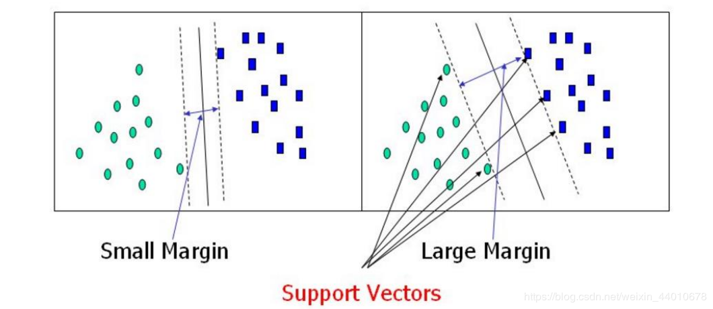
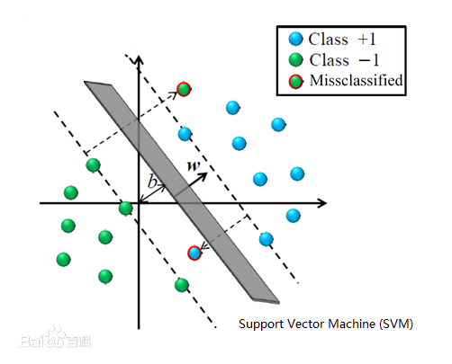
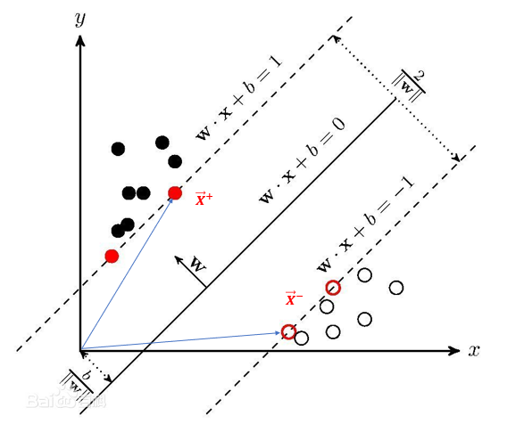

@[TOC](统计学习方法 第7章：支持向量机)

github链接：[https://github.com/gdutthu/Statistical-learning-method](https://github.com/gdutthu/Statistical-learning-method)
知乎专栏链接：[https://zhuanlan.zhihu.com/c_1252919075576856576](https://zhuanlan.zhihu.com/c_1252919075576856576)


**算法总结：**


**补充知识：**

# 1 提出模型

## 1.1 研究背景
我们首先复习一下之前学习的感知机模型。如下图示，感知机（perceptron）是一个**二分类**的**线性二分类模型**，其输入为特征向量，输出为实例类别，为：+1和-1。感知机对应于输入空间（特征空间）中将实例划分为**正负两类的分类超平面。**

但是从上图可看出，**对于两个线性可分的数据，往往是存在多个分类超平面将两类数据区分开。** 当选择不同的分类超平面的时候，分类模型的鲁棒性显然是不一致的。
在下图中，虽然两个模型都能很好的将训练数据集中的两类数据区分开，但是在测试训练集中右边的分类模型泛化能力显然是比左边模型的更好。因为**间隔大的分类超平面对训练样本局部扰动的"容忍"性最好。**

基于上面的分析过程，我们希望能找到一个"最佳"的分类超平面，即这个超平面既要能准确分类训练数据集数据，也要对测试数据集保持较高的泛化能力。直观上，**"最佳"的分类超平面是位于两类训练样本"正中间"的划分超平面**。即在下图所示两类数据中的"最佳"的分类超平面应该为黑色实线所表示的分类超平面。

综上所述，我们可以看到支持向量机模型是希望改进传统的感知机模型。传统的感知机模型仅仅是希望找到分类超平面，而支持向量机模型是希望找到最佳的分类超平面。

## 1.2 目标函数
**注意：**
在下面所有涉及到向量乘法的公式，都采用向量内积的方式来表达，如$\vec w \cdot \vec x+b = 0$。个别教材可能采用矩阵乘法的方法：如向量转置再相乘$w^{T}x+b=0$。数学本质和计算结果是一致的，只是表达方式不一致。

向量$\vec w$为分类超平面为$w^{T}x+b=0$的法向量，向量$\vec u$为需要预测的任意向量。定义以下分类方法，若$\vec u$向量满足$\vec w\cdot \vec u\geq c$，$\vec w\cdot \vec u+b\geq 0$（其中$b=-c$），则向量$\vec u$向量代表的样本数据为正样本数据。即：

$$\left\{\begin{array}{r}
&正类：\vec w \cdot \vec x+b \geq 0, y=+1 \\
&负类：\vec w \cdot \vec x+b \leq 0, y=-1\\
\end{array}\right.$$




假设 $\epsilon$是一个足够小的正数，使得上面不等式成立。则原不等式可以化简成下述形式
$$\left\{\begin{array}{r}
&正类：\vec w \cdot \vec x+b \geq \epsilon, y=+1 \\
&负类：\vec w \cdot \vec x+b \leq \epsilon, y=-1\\
\end{array}\right.$$
当$\lambda≠0$时，超平面方程$w^{T}x+b=\epsilon$与$\lambda (w^{T}x+b)=\lambda \epsilon$表述的是同一个分类超平面。因此，为了计算上的简便性，令$\lambda \epsilon=1，\vec w=\lambda \vec w，b=\lambda b$，将原不等式化简为以下形式。

$$\left\{\begin{array}{r}
&正类：\vec w \cdot \vec x_{+}+b \geq +1, y=+1 \\
&负类：\vec w \cdot \vec x_{-}+b \leq -1, y=-1\\
\end{array}\right.$$
通过上面式子可发现，任意点都满足$y_{i}(\vec w \cdot \vec x_{i}+b)\geq 1$，即$y_{i}(\vec w \cdot \vec x_{i}+b)-1\geq 0$。在边缘处的点$x_{i}$满足
$$\begin{aligned}
y_{i}(\vec w \cdot \vec x_{i}+b)-1=0   （1）
\end{aligned}$$
在正类数据的边界任取一点$x^{+}$,原点和点$x^{+}$构成向量$\vec  x^{+}$；在负类数据的边界任取一点$x^{-}$,原点和点$x^{+}$构成向量$\vec  x^{-}$。向量$\vec  {x^{-}x^{+}}$法向量$\vec  {w}$上的投影即为两类数据之间的最小间隔。根据向量投影的相关知识可得
$$\begin{aligned}
width&=\frac{\vec  {x^{-}x^{+}}\cdot\vec  {w}}{\left\|w\right\|}\\
&=\frac{(\vec  {x^{+}}-\vec  {x^{-}})\cdot\vec  {w}}{\left\|w\right\|} (2)
\end{aligned}$$

将公式(2)代入公式(1)可得
$\vec x^{+}\cdot\vec  {w}=\frac{1}{y_{+}}-b=+1-b$
$\vec x^{-}\cdot\vec  {w}=\frac{1}{y_{-}}-b=-1-b$
则公式(2)可以进一步化为

$$\begin{aligned}
width&=\frac{(+1-b)-(-1-b)}{\left\|w\right\|}=\frac{2}{\left\|w\right\|} \\
\end{aligned}$$
又因为**支持向量机算法是希望找到一个最大间隔的分类超平面**。则支持向量机的数学模型如下：
$$\begin{aligned}
&\max _{w,b}  \frac{2}{\left\|w\right\|}\\
&s.t. y_{i}(\vec w \cdot \vec x_{i}+b)\geq 1,i=1,2,...,m
\end{aligned}$$
因为最大化$\frac{2}{\left\|w\right\|}$等价于最小化$\frac{1}{2}\left\|w\right\|^{2}$。则该模型可以进一步写为
$$\begin{aligned}
&\min _{w,b}  \frac{1}{2}\left\|w\right\|^{2}\\
&s.t. y_{i}(\vec w \cdot \vec x_{i}+b)\geq 1,i=1,2,...,m
\end{aligned}$$
# 2 对偶问题
经过上一小节的推导，我们得到支持向量机模型的数学模型为
$$\begin{aligned}
&\min _{w,b}  \frac{1}{2}\left\|w\right\|^{2}\\
&s.t. y_{i}(\vec w \cdot \vec x_{i}+b)\geq 1,i=1,2,...,m
\end{aligned}$$
**这个问题为凸二次规划问题**。为了更加高效的求解这个凸二次规划问题，下面使用拉格朗日乘子法将其转化为对偶问题(dual problem)。
在原问题的每条约束添加拉格朗日乘子$\alpha_{i}\geq0$。原问题转为

$$\begin{aligned}
L(w,b,\alpha)=\frac{1}{2}\left\|w\right\|^{2}- \sum_{n=1}^m{\alpha_{i}(y_{i}(\vec w \cdot \vec x_{i}+b)-1)} (3)
\end{aligned}$$
其中，$\alpha=(\alpha_{1},\alpha_{2},...,\alpha_{m})$
令$L(w,b,\alpha)$对$\vec w$和$b$的偏导数为0，可得

$$\begin{aligned}
&\frac{\partial L}{\partial \vec w}=\vec w -\sum_{n=1}^m {\alpha_{i}y_{i}\vec x_{i}}=0\\
&\frac{\partial L}{\partial b}=-\sum_{n=1}^m {\alpha_{i}y_{i}}=0
\end{aligned}$$
即可得
$$\begin{aligned}
&\vec w =\sum_{n=1}^m {\alpha_{i}y_{i}\vec x_{i}}\\
&\sum_{n=1}^m {\alpha_{i}y_{i}}=0
\end{aligned}$$
将上式代入原表达式$L(w,b,\alpha)$，可得
$$\begin{aligned}
L(w,b,\alpha)&=\frac{1}{2}(\sum_{n=1}^m {\alpha_{i}y_{i}\vec x_{i}})(\sum_{n=1}^m {\alpha_{i}y_{i}\vec x_{i}})- (\sum_{n=1}^m{\alpha_{i}y_{i}  \vec x_{i})\cdot(\sum_{n=1}^m {\alpha_{i}y_{i}\vec x_{i}})}-\sum_{n=1}^m{\alpha_{i}y_{i}b}+\sum_{n=1}^m{\alpha_{i}}\\
&=\frac{-1}{2}(\sum_{n=1}^m {\alpha_{i}y_{i}\vec x_{i}})(\sum_{n=1}^m {\alpha_{i}y_{i}\vec x_{i}})-\sum_{n=1}^m{\alpha_{i}y_{i}b}+\sum_{n=1}^m{\alpha_{i}}
\end{aligned}$$
由$\sum_{n=1}^m {\alpha_{i}y_{i}}=0$推得子式$\sum_{n=1}^m {\alpha_{i}y_{i}b}=0$，故上式可进一步简记为
$$\begin{aligned}
L(w,b,\alpha)=\sum_{n=1}^m{\alpha_{i}}-\frac{1}{2}\sum_{i=1}^m\sum_{j=1}^m\alpha_{i}\alpha_{j}y_{i}y_{j}\vec x_{i}\vec x_{j}
\end{aligned}$$
则原问题的对偶问题问题为
$$\begin{aligned}
\max _{\alpha}  &\sum_{n=1}^m{\alpha_{i}}-\frac{1}{2}\sum_{i=1}^m\sum_{j=1}^m\alpha_{i}\alpha_{j}y_{i}y_{j}\vec x_{i}\vec x_{j}\\
s.t.&\sum_{n=1}^m {\alpha_{i}y_{i}}=0\\
&C\geq\alpha_{i}\geq 0,i=1,2,...,m
\end{aligned}$$
注意，这里的常数C是用于控制“最大化间隔”和“保证大部分店的函数间隔小于1”这两个目标的权重。
求得对偶问题的最优解$\alpha^{*}=(\alpha_{1}^{*},\alpha_{2}^{*},...,\alpha_{m}^{*})$后，便可得原问题的最优解
$$\begin{aligned}
&\vec w^{*} =\sum_{n=1}^m {\alpha_{i}^{*}y_{i}\vec x_{i}}\\
&b^{*}=\frac{1}{m}\sum_{n=1}^m {(y_{i}-\vec w^{*} \cdot\vec x_{i})}
\end{aligned}$$


# 3 SMO算法

经过上一小节可知，原问题的对偶问题问题为
$$\begin{aligned}
\max _{\alpha}  &\sum_{n=1}^m{\alpha_{i}}-\frac{1}{2}\sum_{i=1}^m\sum_{j=1}^m\alpha_{i}\alpha_{j}y_{i}y_{j}\vec x_{i}\vec x_{j}\\
s.t.&\sum_{n=1}^m {\alpha_{i}y_{i}}=0\\
&C\geq\alpha_{i}\geq 0,i=1,2,...,m
\end{aligned}$$
**这个问题是凸二次规划问题，具有全局最优解，** 可以采用一些传统的最优化算法对该问题进行求解。但训练样本过大时，这些方法往往是比较低效的。

SMO算法的详尽推导过程可以参考《统计学习方法》。这里只介绍如何使用该方法来求解目标问题。以下内容讲解顺序即为算法流程顺序。


## 3.1、数据预处理：核处理
采用核函数对训练样本进行处理，将低维线性不可分的数据映射到高维度上，变成高维度上的线性可分数据。**对同一个数据集采用不同的核函数进行预处理，采用相同的算法，最后的分类效果也不尽相同。** 在mnist数据集上，采用高斯核函数（Gaussian kernel function）对数据进行预处理。

$$\begin{aligned}
K(x,z)=exp(-\frac{\left\|x-z\right\|^{2}}{2\sigma^{2}})
\end{aligned}$$
若训练数据集为m x n的矩阵，m为样本个数，n为特征维度，则所得高斯核函数矩阵$K$为大小为m x m的对称矩阵，其中$K[i,j]=K[j,i]$
**总结：**
1、大小为m x n的矩阵进行高斯核函数处理，得到一个大小为m x m的对称矩阵；
2、两个长度一致的向量进行高斯核函数处理，得到一个数。

## 3.2、参数初始化：$alpha，b$
将所要求就求解的alpha变量初始化为$\alpha=(\alpha^{(1)},\alpha^{(2)},...,\alpha^{(m)})=（0，0，...,0）$,其中$m$为训练样本的个数。分类超平面的偏置$b=0$


## 3.3、样本标签的预测数值
第$i$样本标签的预测数值$g(x_{i})$采用以下公式
$$\begin{aligned}
g(x_{i})=\sum_{j=1}^{N}{\alpha_{j}y_{j}K(x_{i},x_{j})}+b
\end{aligned}$$
第$i$样本标签的预测数值与真实标签的差值
$$\begin{aligned}
E_{i}=g(x_{i})-y_{j}=(\sum_{j=1}^{N}{\alpha_{j}y_{j}K(x_{i},x_{j})}+b)-y_{j}
\end{aligned}$$
因为将$\alpha$初始化为零向量。故一开始时，不同的$\alpha^{i}$对应的$g(x_{i})$为0，$E_{i}$为$-y_{j}$。
## 3.4、确认alpha参数

alpha参数更新时，是同时更新一对alpha参数（下面记为alpha1、alpha2）。在训练时，我们是先确认alpha1，再依据alpha1来确认alpha2。
### 3.4.1、确认alpha1
alpha1是判断该变量是否满足KKT条件来确认。
1、从头开始遍历向量$\alpha=(\alpha^{(1)},\alpha^{(2)},...,\alpha^{(m)})$中的$\alpha^{(1)},\alpha^{(2)},...,\alpha^{(m)}$
2、依次判断$\alpha^{(i)}$是否满足KKT条件。KKT条件的表述如下：

$$\begin{aligned}
\alpha^{(i)}=0 \Longleftrightarrow	y_{i}g(x_{i})\geq0\\
0 < \alpha^{(i)}<C\Longleftrightarrow	y_{i}g(x_{i})=0\\
\alpha^{(i)}=C\Longleftrightarrow	y_{i}g(x_{i})\leq0\\
\end{aligned}$$
其中，$C$是软间隔的松弛变量，$g(x_{i})$是第$i$个样本标签的预测数值，$y(x_{i})$是第$i$个样本的真实标签。
不满足上述条件的$\alpha^{(i)}$就是我们所要的alpha1。

### 3.4.2、确认alpha2
确认完alpha1后，去计算其他$\alpha^{(i)}$所对应的$item=|E_{alpha1}-E_{i}|$。$item$最大时对应的$\alpha^{(i)}$就是我们所需的alpha2变量。

值得一提的是，在上面内容中提到，初始化时所有的$\alpha^{(i)}$对应的$E_{i}$均为$-y(i)$，此时的$item$没有实际意义。此时的alpha2采用随机的方法进行选取。

## 3.5、更新参数
### 3.5.1 更新alpha2参数
沿着约束方向未经剪辑的解
$$\begin{aligned}
\alpha_{2}^{new,unc}=\alpha_{2}^{old}+\frac{y_{2}(E_{1}-E_{2})}{\eta
}\\
\end{aligned}$$

其中，
$$\begin{aligned}
\eta=K_{11}+K_{22}-2K_{12}=\left\|\phi(x_{1})-\phi(x_{2})\right\|^{2}
\end{aligned}$$
再来沿着约束方向对alpha2参数进行剪辑。分为两种情况，$y_{1}，y_{2}$分别为alpha1，alpha2所对应的样本的真实标签数值。
如果$y_{1}≠y_{2}$，alpha2参数的上下界限如下：
$$\begin{aligned}
L=max(0,\alpha_{2}^{old}-\alpha_{1}^{old}),H=min(C,C+\alpha_{2}^{old}-\alpha_{1}^{old})
\end{aligned}$$
如果$y_{1}=y_{2}$，alpha2参数的上下界限如下：
$$\begin{aligned}
L=max(0,\alpha_{2}^{old}+\alpha_{1}^{old}-C),H=min(C,\alpha_{2}^{old}+\alpha_{1}^{old})
\end{aligned}$$
经过剪辑后，alpha2参数的解为：

$$ \alpha_{2}^{new}=\left\{
\begin{aligned}
H & ,&\alpha_{2}^{new,unc} >H \\
\alpha_{2}^{new,unc} &,&L\leq \alpha_{2}^{new,unc} \leq H\\
L& ,&\alpha_{2}^{new,unc} <L
\end{aligned}
\right.
$$

### 3.5.2 更新alpha1参数
结合上面所得alpha2参数来更新alpha1参数
$$\begin{aligned}
\alpha_{1}^{new}=\alpha_{1}^{old}+y_{1}y_{2}(\alpha_{2}^{old}-\alpha_{2}^{new})
\end{aligned}$$
## 3.6 更新偏置b
若$0<\alpha_{1}^{new}<C$,偏置参数b更新为
$$\begin{aligned}
b_{1}^{new}=-E_{1}+y_{1}K_{11}(\alpha_{1}^{new}-\alpha_{1}^{old})-y_{2}K_{21}(\alpha_{2}^{new}-\alpha_{2}^{old})+b^{old}
\end{aligned}$$
若$0<\alpha_{2}^{new}<C$,偏置参数b更新为
$$\begin{aligned}
b_{2}^{new}=-E_{2}-y_{1}K_{12}(\alpha_{1}^{new}-\alpha_{1}^{old})-y_{2}K_{22}(\alpha_{2}^{new}-\alpha_{2}^{old})+b^{old}
\end{aligned}$$
综上所述，以上就是SMO算法一轮迭代求解的全部内容。


# 4 代码附录
在这里采用mnist数据中label=0和label=1的数据进行二分类实验，采用TensorFlow2.0进行加载数据。将label=0的数据改成label=-1。

因为数据预处理存在高斯核函数处理，为了缩短测试时间，数据集就选取了前面1000个样本实例点，如果想测试完全样本点，可以稍微修改一下代码。
```python
import  tensorflow as  tf
import numpy as np
import random

# 加载训练mnist数据集的数据集和测试数据集
#因为感知机是二分类模型，故选取label=0和1的样本点，并且将label=0改成label=-1
def MnistData():
    #原始的训练数据集是60000张尺寸为28*28的灰色照片，测试数据集是10000张尺寸为28*28的灰色照片
    mnist = tf.keras.datasets.mnist
    (train_data, train_label), (test_data, test_label) = mnist.load_data()
    train_data = train_data.reshape(60000, 784)
    test_data = test_data.reshape(10000, 784)
    #提取出label=0和label=1的样本点
    train_data = train_data [np.where((train_label==0)  | (train_label== 1))]
    train_label = train_label[np.where((train_label==0) |  (train_label == 1))]
    test_data  = test_data[np.where((test_label == 0)  |  (test_label== 1))]
    test_label = test_label[np.where((test_label== 0)  |  (test_label == 1))]
    #修改label的格式，默认格式为uint8，是不能显示负数的，将其修改为int8格式
    train_label=np.array(train_label,dtype='int8')
    test_label =np.array(test_label,dtype='int8')
    #将label=0改成label=-1
    train_label[np.where(train_label== 0)] = -1
    test_label [np.where(test_label == 0)] = -1
    return (train_data, train_label), (test_data, test_label)


#支持向量机的类
class SVM():
    #参数初始化
    def __init__(self,train_data, train_label, sigma = 10, C = 200, toler = 0.001):
        self.train_data=train_data                           #训练数据集，格式为：m*n
        self.train_label=train_label                         #训练标签集
        self.m, self.n = np.shape(self.train_data)           #m：训练集数量    n：样本特征数目
        self.sigma = sigma                                   #高斯核分母中的σ
        self.C = C                                           #软间隔的惩罚参数
        self.toler = toler                                   #松弛变量
        self.b = 0                                           #SVM模型分类超平面对应的偏置b
        self.k = self.GaussKernel()                          #高斯核函数（初始化时提前计算）
        self.alpha = np.zeros(self.m)                         # 每个样本的alpha系数，格式为：1*m
        self.supportVecIndex = []                            #存储训练数据集中支持向量的下标索引
        # self.E用来存放，每个alpha变量对应样本的标签的预测误差的Ei，格式为：m*1
        self.E = [[i, 0] for i in range(self.train_label.shape[0])]

    #高斯核函数
    #对应《统计学习方法》 第二版 公式7.90
    # k[i][j] = Xi * Xj，核函数矩阵格式：训练集长度m * 训练集长度m
    def GaussKernel(self):
        k = np.zeros(shape=(self.m,self.m))     # 初始化高斯核结果矩阵，核函数矩阵为大小为m*m的对称矩阵，m为样本个数
        for i in range(self.m):
            x = self.train_data[i]               # 得到式7.90中的x
            for j in range(i, self.m):
                z = self.train_data[j]           # 获得式7.90中的z
                # step1:先计算||x - z||^2
                step1 = np.dot((x-z),(x-z).T)
                # step2:分子除以分母后去指数，得到的即为高斯核结果
                step2 = np.exp(-1 * step1 / (2 * self.sigma ** 2))
                k[i,j] = step2           # 将Xi*Xj的结果存放入k[i][j]和k[j][i]中
                k[j,i] = step2
        return k                          # 返回高斯核矩阵

    #单独计算两个向量的高斯核函数
    #对应《统计学习方法》 第二版 公式7.90
    #两个向量的高斯核函数对应一个常数
    def SinglGaussKernel(self, x1, x2):
        step1=np.dot((x1 - x2),(x1 - x2).T)                  # step1:先计算||x - y||^2
        step2 = np.exp(-1 * step1 / (2 * self.sigma ** 2))   # step2:分子除以分母后去指数，得到的即为高斯核结果
        return step2   # 返回结果

    #第i个alpha变量对应的样本的标签预测数值g(xi)
    #对应《统计学习方法》 第二版 公式7.104
    def calc_gxi(self, i):
        gxi = 0                                                       # 初始化g(xi)
        index=[]                                                       #初始化一个空列表
        for i in range(len(self.alpha)):                               # index获得非零α的下标，,即支持向量的下标索引
            if self.alpha[i]!=0:
                index.append(i)
        for j in index:                                                #遍历非零α的下标
            gxi += self.alpha[j] * self.train_label[j] * self.k[j,i]   #g(xi)求和
        gxi += self.b                                                  #求和结束后再单独加上偏置b
        return gxi

    #函数g(x)对输入xi的预测值与真实输出yi之差
    #对应《统计学习方法》 第二版 公式7.105
    #关键变量说明：
    # gxi:第i个alpha变量对应的样本的标签预测数值g(xi)
    def calcEi(self, i):
        gxi = self.calc_gxi(i)         #计算预测数值g(xi)
        Ei= gxi - self.train_label[i]  #预测数值g(xi)与真实输出yi之差
        return Ei

    #判断第i个alpha是否满足KKT条件
    #对应《统计学习方法》 第二版 公式7.111，7.112，7.113
    #输出参数说明：
    # True：满足
    # False：不满足
    def isSatisfyKKT(self, i):
        gxi = self.calc_gxi(i)    #第i个样本标签的预测数值
        yi = self.train_label[i]  #第i个样本的真实标签

        # 依据公式7.111
        if (abs(self.alpha[i]) < self.toler) and (yi * gxi >= 1):
            return True
        # 依据公式7.112
        elif (-self.toler<self.alpha[i] and self.alpha[i] < self.C + self.toler) \
                and (abs(yi * gxi - 1) < self.toler):
            return True
        # 依据公式7.113
        elif (abs(self.alpha[i] - self.C) < self.toler) and (yi * gxi <= 1):
            return True
        return False

    #输入变量: E1: 第一个变量的ei,i: 第一个变量α1的下标
    #输出变量：E2:第二个变量的ei，第二个变量α2的下标
    def getAlphaJ(self, E1, i):
        E2 = 0          # 初始化e2
        maxE1_E2 = -1   # 初始化|E1-E2|为-1
        maxIndex = -1   # 初始化第二个变量的下标

        #获得Ei非0的对应索引组成的列表，列表内容为非0Ei的下标i
        #如果Ei全为0，则证明为第一次迭代训练
        nozeroE = [i for i, Ei in enumerate(self.E) if Ei != 0]
        for j in nozeroE:                           # 对每个非零Ei的下标i进行遍历
            E2_tmp = self.calcEi(j)                 # 计算E2
            if  abs(E1 - E2_tmp) > maxE1_E2:        # 如果|E1-E2|大于目前最大值
                maxE1_E2 = abs(E1 - E2_tmp)         # 更新最大值
                E2 = E2_tmp                         # 更新最大值E2
                maxIndex = j                        # 更新最大值E2的索引j
        if maxIndex == -1:           # 如果列表中没有非0元素了（对应程序最开始运行时的情况）
            maxIndex = i
            while maxIndex == i:     # 获得随机数，如果随机数与第一个变量的下标i一致则重新随机
                maxIndex = int(random.uniform(0, self.m))
            E2 = self.calcEi(maxIndex)     # 获得E2
        return E2, maxIndex                # 返回第二个变量的E2值以及其索引

    #训练模型
    def train(self, epoch=100):
        # parameterChanged：单次迭代中有参数改变则增加1
        parameterChanged = 1    # 状态变量，用来判断alpha相邻两次迭代训练是否发生变化
        iterStep = 0            # iterStep：迭代次数，超过设置次数上限epoch还未收敛则强制停止


        # 如果没有达到限制的迭代次数以及上次迭代中有参数改变则继续迭代
        # parameterChanged==0时表示上次迭代没有参数改变，如果遍历了一遍都没有参数改变，说明
        # 达到了收敛状态，可以停止了
        while (iterStep < epoch) and (parameterChanged > 0):
            print('iter:%d:%d' % (iterStep, epoch))   # 打印当前迭代轮数
            iterStep += 1                             # 迭代步数加1
            parameterChanged = 0                      # 新的一轮将参数改变标志位重新置0

            for i in range(self.train_data.shape[0]): # 大循环遍历所有样本，用于找SMO中第一个变量
                # 查看第一个遍历是否满足KKT条件，如果不满足则作为SMO中第一个变量从而进行优化
                if self.isSatisfyKKT(i) == False:
                    # 如果下标为i的α不满足KKT条件，则将该变量视作第一个优化变量，进行优化
                    E1 = self.calcEi(i)             # 选择第1个优化变量
                    E2, j = self.getAlphaJ(E1, i)   # 选择第2个优化变量

                    y1 = self.train_label[i]        # 获得两个优化变量的真实标签
                    y2 = self.train_label[j]

                    alphaOld_1 = self.alpha[i].copy()  # 复制α值作为old值
                    alphaOld_2 = self.alpha[j].copy()

                    # 依据标签是否一致来生成第二个优化变量α2的约束上下界限L和H
                    # 对应《统计学习方法》 第二版 公式7.103以及7.104之间的公式
                    if y1 != y2:
                        L = max(0, alphaOld_2 - alphaOld_1)
                        H = min(self.C, self.C + alphaOld_2 - alphaOld_1)
                    else:
                        L = max(0, alphaOld_2 + alphaOld_1 - self.C)
                        H = min(self.C, alphaOld_2 + alphaOld_1)
                    # 如果两者相等，说明该变量无法再优化，直接跳到下一次循环
                    if L == H:
                        continue

                    # 计算α的新值
                    # 对应《统计学习方法》 第二版 公式7.106更新α2值
                    # 先获得几个k值，用来计算事7.106中的分母η
                    k11 = self.k[i,i]                                          #先获得不同位置的核函数
                    k22 = self.k[j,j]
                    k21 = self.k[j,i]
                    k12 = self.k[i,j]
                    r=k11 + k22 - 2 * k12                                        #对应《统计学习方法》 第二版 公式7.107的分母η
                    alphaNew_2 = alphaOld_2 + y2 * (E1 - E2) / r                 # 依据式7.106更新α2，该α2还未经剪切
                    if alphaNew_2 < L:                                           # 剪切α2，对应《统计学习方法》 第二版 公式7.108
                        alphaNew_2 = L
                    elif alphaNew_2 > H:
                        alphaNew_2 = H
                    alphaNew_1 = alphaOld_1 + y1 * y2 * (alphaOld_2 - alphaNew_2) # 更新α1，依据式7.109

                    # 对应《统计学习方法》 第二版 公式7.115和7.116
                    #更新偏执b，计算b1和b2
                    b1New = -1 * E1 - y1 * k11 * (alphaNew_1 - alphaOld_1) \
                            - y2 * k21 * (alphaNew_2 - alphaOld_2) + self.b
                    b2New = -1 * E2 - y1 * k12 * (alphaNew_1 - alphaOld_1) \
                            - y2 * k22 * (alphaNew_2 - alphaOld_2) + self.b

                    # 依据α1和α2的值范围确定新b
                    if (alphaNew_1 > 0) and (alphaNew_1 < self.C):
                        bNew = b1New
                    elif (alphaNew_2 > 0) and (alphaNew_2 < self.C):
                        bNew = b2New
                    else:
                        bNew = (b1New + b2New) / 2

                    # 将更新后的各类值写入，进行更新
                    self.alpha[i] = alphaNew_1
                    self.alpha[j] = alphaNew_2
                    self.b = bNew

                    self.E[i] = self.calcEi(i)
                    self.E[j] = self.calcEi(j)

                    # 如果α2的改变量过于小，就认为该参数未改变，不增加parameterChanged值
                    # 反之则自增1
                    if abs(alphaNew_2 - alphaOld_2) >= 0.00001:
                        parameterChanged += 1

                # 打印迭代轮数，i值，该迭代轮数修改α数目
                print("iter: %d i:%d, pairs changed %d" % (iterStep, i, parameterChanged))

        # 全部计算结束后，重新遍历一遍α，查找里面的支持向量
        for i in range(self.m):
            # 如果α>0，说明是支持向量
            if self.alpha[i] > 0:
                # 将支持向量的索引保存起来
                self.supportVecIndex.append(i)

    #对样本的标签进行预测
    def predict(self,sample):
        result = 0
        # 遍历所有支持向量，计算求和式
        #因为非支持向量的系数alpha为0
        for i in self.supportVecIndex:
            tmp = self.SinglGaussKernel(self.train_data[i], sample)      #先单独将核函数计算出来
            result += self.alpha[i] *tmp                                 #对每一项子式进行求和，最终计算得到求和项的值
        result = np.sign(result+self.b)                                  #求和项计算结束后加上偏置b,再进行sign函数处理
        return result

    #svm模型测试
    def test(self, test_data, test_label):
        errorCnt = 0                               # 错误计数值
        for i in range(test_data.shape[0]):        # 遍历测试集所有样本
            result = self.predict(test_data[i])    # 获取预测结果
            if result != test_label[i]:            # 如果预测与标签不一致，错误计数值加一
                errorCnt += 1
        acc=1 - errorCnt / test_data.shape[0]      #模型预测准确率为
        print("模型预测准确率为:%f" %(acc))         #打印预测准确率
        return   acc                               # 返回正确率

if __name__=="__main__":
    # 加载mnist数据集中label=0和label=+1的数据，并且将label=0改成label=-1
    (train_data, train_label), (test_data, test_label)=MnistData()

    #初始化SVM类
    print('start init SVM')
    svm = SVM(train_data[:1000], train_label[:1000],sigma = 10, C = 200, toler = 0.001)

    # 开始训练
    print('start to train')
    svm.train()

    # 开始测试
    print('start to test')
    accuracy = svm.test(test_data, test_label)
    print('the accuracy is:%d' % (accuracy * 100), '%')
```

