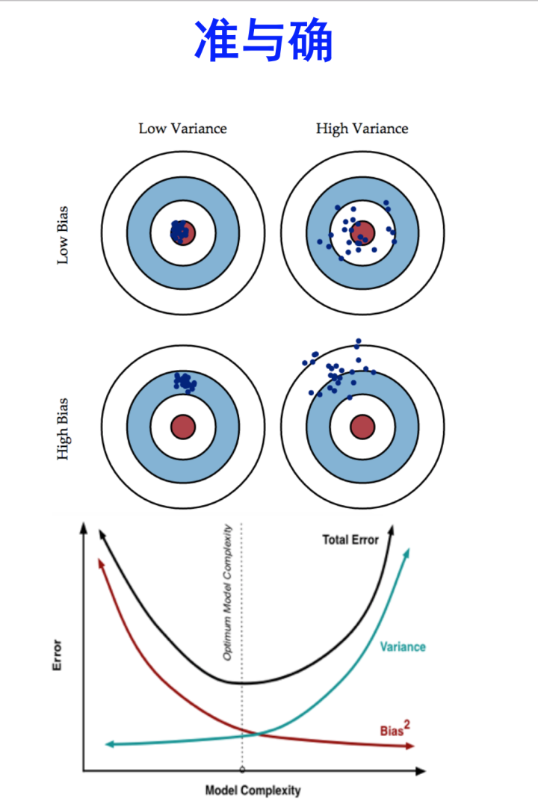
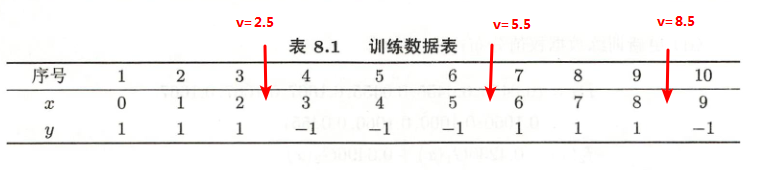

@[TOC](统计学习方法 第8章：提升方法)

github链接：[https://github.com/gdutthu/Statistical-learning-method](https://github.com/gdutthu/Statistical-learning-method)
知乎专栏链接：[https://zhuanlan.zhihu.com/c_1252919075576856576](https://zhuanlan.zhihu.com/c_1252919075576856576)

**算法总结：**


**补充知识：**
1、强可学习和弱可学习。
2、boosting与bagging算法；


# 1 提出模型
## 1.1 强、弱学习算法
**补充知识：**
**一、学习算法的强弱**
PAC Learnability(PAC 可学习性)定义了学习算法的强弱
（PAC：probably approximately correct 概率近似正确）

 - **强可学习算法** ---一个概念（一个类），如果存在一个**多项式的学习算法**能够学习他，并且学习的正确率很高，那么就称这个概念是强可学习的。
 - **弱可学习算法**---一个概念（一个类），如果存在一个**多项式的学习算法**能够学习他，但是学习的正确率小于1/2(即准确率仅比随机猜测略高的学习算法)，那么就称这个概念是弱可学习的。


## 1.2 boosting、bagging算法
Bagging和Boosting都是将已有的分类或回归算法通过一定方式组合起来，形成一个性能更加强大的分类器，更准确的说这是一种分类算法的组装方法。即将弱分类器组装成强分类器的方法。

### 1.2.1、Bagging、Boosting算法思路
**一、Bagging (bootstrap aggregating)算法**

Bootstraping，即自助法：它是**一种有放回的抽样方法（可能抽到重复的样本）**。
Bagging即套袋法，其算法过程如下：

step1：从原始样本集中抽取训练集。每轮从原始样本集中使用Bootstraping的方法抽取n个训练样本 **（在训练集中，有些样本可能被多次抽取到，而有些样本可能一次都没有被抽中）** 。共进行k轮抽取，得到k个训练集。（k个训练集之间是相互独立的）

step2:每次使用一个训练集得到一个模型，k个训练集共得到k个模型。（注：这里并没有具体的分类算法或回归方法，我们可以根据具体问题采用不同的分类或回归方法，如决策树、感知器等）

step3：对分类问题：将上步得到的k个模型采用投票的方式得到分类结果；对回归问题，计算上述模型的均值作为最后的结果。**（所有模型的重要性相同）**

**二、Boosting算法**

 **每次使用的是全部的样本，每轮训练改变样本的权重。** 下一轮训练的目标是找到一个函数f 来拟合上一轮的残差。当残差足够小或者达到设置的最大迭代次数则停止。Boosting会减小在上一轮训练正确的样本的权重，增大错误样本的权重。（对的残差小，错的残差大）。**将弱分类器线性组装成一个强分类器。**

关于Boosting的两个核心问题：

1）在每一轮如何改变训练数据的权值或概率分布？

通过提高那些在前一轮被弱分类器分错样例的权值，减小前一轮分对样例的权值，来使得分类器对误分的数据有较好的效果。

2）通过什么方式来组合弱分类器？

**通过加法模型将弱分类器进行线性组合**，比如AdaBoost通过加权多数表决的方式，即增大错误率小的分类器的权值，同时减小错误率较大的分类器的权值。

而提升树通过拟合残差的方式逐步减小残差，将每一步生成的模型叠加得到最终模型。


### 1.2.2、Bagging、Boosting二者的区别
Bagging和Boosting的区别：

**1）样本选择上：**
Bagging：训练集是在原始集中有放回选取的，从原始集中选出的各轮训练集之间是独立的。
Boosting：每一轮的训练集不变，只是训练集中每个样例在分类器中的权重发生变化。而权值是根据上一轮的分类结果进行调整。

**2）样例权重：**
Bagging：使用均匀取样，每个样例的权重相等
Boosting：根据错误率不断调整样例的权值，错误率越大则权重越大。

**3）预测函数：**
Bagging：所有预测函数的权重相等。
Boosting：每个弱分类器都有相应的权重，对于分类误差小的分类器会有更大的权重。

**4）并行计算：**
Bagging：各个预测函数可以并行生成
Boosting：各个预测函数只能顺序生成，因为后一个模型参数需要前一轮模型的结果。


### 1.2.3、bagging减少variance，boosting减少bias
**一、什么是variance，什么是bias**
**variance：** 模型在测试集的预测误差。对于过拟合的模型，预测误差就较大，此时就会存在High variance。
 **bias：** 训练模型在训练集中的误差（损失函数之类的）。对于欠拟合的模型，此时就会存在High bias。

High variance 是model过于复杂overfit，记住太多细节noise，受outlier影响很大；high bias是underfit，model过于简单，cost function不够好。


**二、具体原因**

参考链接：[https://www.zhihu.com/question/26760839/answer/40337791](https://www.zhihu.com/question/26760839/answer/40337791)


# 2 boosting算法
## 2.1 基础知识


**算法本质：** Boosting算法是将“弱学习算法”提升为“强学习算法”的过程。
**模型组成：** Boosting算法主要涉及两个部分：加法模型和前向分步算法。

①**加法模型**就是说强分类器是由一系列若分类器**线性相加**而成。具体的组合形式如下：
$$
F_{m}(x,p)=\sum_{m=1}^{n}\beta_{m}h(x,\alpha_{m})
$$
其中，$h(x,\alpha_{m})$就是一个个弱分类器，$\alpha_{m}$是弱分类器学习到的最优参数，$\beta_{m}$是弱分类器在强分类器中所占的比重，$p$就是所有$\alpha_{m}$和$\beta_{m}$的组合。这些弱分类器线性相加组成强分类器。

②**前向分步**就是说在训练过程中，下一轮迭代产生的分类器是在上一轮的基础上训练得来的。因此Boosting模型的表达式也可以写成下面这种形式：
$$
F_{m}(x)=F_{m-1}(x)+\beta_{m}h(x,\alpha_{m})
$$
由于采用的损失函数不同。Boosting算法也因此有了不同的类型。AdaBoost就是损失函数为指数损失的Boosting算法。
## 2.2 AdaBoost
在代码前补充一些知识：
https://blog.csdn.net/qq_36523839/article/details/81904966

输入：训练数据集$T=\{(x_{1},y_{1}),(x_{2},y_{2},...,(x_{N},y_{N}))\}$，其中$x_{i}\in \chi \in R_{n}$，$y_{i}=\{-1,+1\}$;弱分类器
输出：最终分类器$G(x)$

（1）初始化训练数据集的权值分布
$$
D_{1}=(w_{11},w_{12},....,w_{1N}),w_{1i}=\frac{1}{N},i=1,2,...,N
$$
（2）对$m=1,2，...,M$

 - 使用具有权值分布$D_{m}$的训练数据集学习，得到基本分类器
$$
G_{m}(x):\chi \rightarrow	\{-1,+1\}
$$

 - 计算$G_{m}(x)$在训练数据集上的分类误差率

**分类误差实际上就是误分类点的权值之和。** 故分类误差率可以写成以下形式：
$$
e_{m}=\sum_{i=1}^{N}{P(G_{m}(x_{i}≠y_{i}))}=\sum_{i=1}^{N}{w_{m,i}I(G_{m}(x_{i}≠y_{i}))}=\sum_{i=1且G_{m}(x_{i}≠y_{i})}^{N}w_{m,i}
$$
注意:这里的$w_{m,i}$表示在第$m$轮中第$i$个实例的权值，$\sum_{i=1}^{N}w_{m,i}=1$
 - 更新训练数据集的权值分布
$$
D_{m+1}=(w_{m+1,1},w_{m+1,2},...,w_{m+1,N})
$$
这里的$w_{m+1,i}$表示在第$m+1$轮中第$i$个实例的权值
$$
w_{m+1,i}=\frac{w_{m,i}}{Z_{m}}\exp(-\alpha_{m}y_{i}G_{m}(x_{i}))),i=1,2,..,N
$$
因为$y_{i}=\{-1,+1\}，G_{m}(x_{i})=\{-1,+1\}$，所以上式也可以写成
$$
w_{m+1,i}=\left\{
\begin{aligned}
\frac{w_{m,i}}{Z_{m}}\exp(-\alpha_{m}) & ,&G_{m}(x_{i})=y_{i} \\
\frac{w_{m,i}}{Z_{m}}\exp(+\alpha_{m})  &,&G_{m}(x_{i})≠y_{i}\\
\end{aligned}
\right.
$$


这里，$Z_{m}$是规范化因子，它使得$D_{m+1}$成为一个概率分布。
$$
Z_{m}=\sum_{i=1}^{N}{w_{m,i}\exp(-\alpha_{m}y_{i}G_{m}(x_{i}))}
$$

- 计算弱分类$G_{m}(x)$在总分类所占比例

$$
\alpha=\frac{1}{2}\log{\frac{1-e_{m}}{e_{m}}}
$$

（3）构建基本分类器的线性组合
$$
f(x)=\sum_{m=1}^{M}{\alpha_{m}G_{m}(x)}
$$

$$
\begin{aligned}
G(x)&=sign(f(x))\\
&=sign((\sum_{m=1}^{M}{\alpha_{m}G_{m}(x)}))
\end{aligned}
$$


# 3 adaboost算法的阈值和方向
实现阈值弱分类器时要注意，**这里的分类器除了含有一个阈值，还应有一方向。（这里一开始困惑了我好久）**。以李航教材的例题8.1为例


在adaboost不同轮的弱分类器中，阈值v和方向direction的选择是不一样的。但是他们都是根据这一的原则进行选取。
1、**阈值v** ：两种不同label的左右两个x值去中间值。以下图为例

但是针对一个大数据集而言，想要找出每一个可能的中位数其实是困难的。**在实际编程处理中中，在数值的最小值与最大值范围内，按照一定的步长来生成一个阈值的取值列表**。如对于一个已经归一化后的数据(数值范围在0~1之间)，可以按照补充step=0.1来生成阈值列表。

```python
v=range(0,1,0.1)
```

2、**方向direction**：在第一步d选择阈值，结合样本权值，再来判断阈值的左右哪边代表label=-1和label=1。这就是adaboost算法的方向。
简单来说，有两种方向，

 1. direction1---x<v，y=+1；x>v y=-1
 2. direction2--- x>v y=+1；x<v，y=-1

其中v 是阈值轴，y为，x为实例点

# 4 代码附录
在这里采用mnist数据中label=0和label=1的数据进行二分类实验，采用TensorFlow2.0进行加载数据。为了缩短代码运行时间，只选取了部分的训练数据集。全部代码如下

**注意点：**
1、**TensorFlow加载进来的mnist数据集是uint8格式，不能显示负号，要将数据格式改成int8。**
其中在感知机模型中，需要对label数据进行修改值的操作，data部分不需要。故只需要对label部分数据集改格式。
2、在代码中，可以根据模型的预测误差率来调整弱分类器的总个数。
```python
import  tensorflow as  tf
import numpy as np

#加载训练mnist数据集的数据集和测试数据集
#因为传统的adaboost是二分类模型，故选取label=0和1的样本点，并且将label=0改成label=-1
def MnistData():
    mnist = tf.keras.datasets.mnist                #通过TensorFlow加载mnist数据集
    (train_data, train_label), (test_data, test_label) = mnist.load_data()
    #原始的训练数据集是60000张尺寸为28*28的灰色照片，测试数据集是10000张尺寸为28*28的灰色照片
    train_data = train_data.reshape(60000, 784)    #原始数据集为三维向量，将其转化为二维向量
    test_data = test_data.reshape(10000, 784)
    train_label=train_label.reshape(-1)            #将标签数据集转化为行向量
    test_label=test_label.reshape(-1)
    #提取出label=0和label=1的样本点
    train_data=train_data [np.where((train_label==0)|(train_label== 1))]
    train_label=train_label[np.where((train_label==0)|(train_label == 1))]
    test_data=test_data[np.where((test_label == 0)|(test_label== 1))]
    test_label=test_label[np.where((test_label== 0)|(test_label == 1))]
    #修改label的格式，默认格式为uint8，是不能显示负数的，将其修改为int8格式
    train_label=np.array(train_label,dtype='int8')
    test_label =np.array(test_label,dtype='int8')
    train_label[np.where(train_label== 0)] = -1  #将label=0改成label=-1
    test_label [np.where(test_label == 0)] = -1
    train_data=train_data/255                    #数据进行归一化，使得图像像素点数值在0~1之间
    test_data=test_data/255
    return (train_data, train_label), (test_data, test_label)

class adaboost():
    def __init__(self,train_data, train_label,test_data, test_label,epoch=6):
        self.train_data=train_data                                           #训练数据集
        self.train_label=train_label                                         #训练标签集
        self.test_data = test_data                                           #测试数据集
        self.test_label = test_label                                         #测试标签集
        self.sampleNum=self.train_data.shape[0]                              #训练数据集的样本数目
        self.featureNum=self.train_data.shape[1]                             #特征向量的特征维度
        self.D=np.ones(shape=(self.sampleNum,self.featureNum))/self.sampleNum#初始化样本在每个维度上的分布权值
        self.epoch=epoch                                                     #弱分类器的总个数
        self.alpha=np.ones(shape=(epoch,self.featureNum))       #初始化各个弱分类在不同维度上的权值
        self.v=np.ones(shape=(epoch,self.featureNum))           #初始化各个弱分类在不同维度上的最优阈值v
        self.direction=np.ones(shape=(epoch,self.featureNum))   #初始化各个弱分类在不同维度上的最佳划分方向direction

    # direction1(+1)：x < v，y = +1；x > v,y = -1
    # direction2(-1)：x > v,y = +1；x < v，y = -1
    # 其中v是阈值轴，y为，x为实例点
    #在self.direction矩阵中，+1代表direction1，-1代表direction2

    #寻找direction1情形下(x<v y=1；x > v,y = -1)情况下的阈值v，分类误差率em,分类器占比
    #参数说明：axis:训练数据集选定的特征维度
    def lessFindBestV(self,axis):
        parameter = np.arange(0,1,0.1)                 #生成阈值的可能取值列表,原数据经过归一化，数值范围在0~1之间
        error = np.zeros(len(parameter))               #初始化各个可能取值阈值下的分类误差率
        for v_index in range(len(parameter)):          #遍历阈值轴v
            for index in range(self.sampleNum):        #遍历所有训练样本
                #记录样本点预测分类错误率，即错误预测样本点的权值之和
                if self.train_data[index,axis]<=parameter[v_index] and self.train_label[index]!=1:
                    error[v_index] =error[v_index]+self.D[index,axis]
                elif self.train_data[index,axis]>parameter[v_index] and self.train_label[index]!=-1:
                    error[v_index] = error[v_index] + self.D[index,axis]

        bestV=parameter[np.argmin(error)]  #样本点分类误差率最小对应的阈值v就是最佳阈值
        em=np.min(error)                   #对应的最佳的预测误差率
        alpha=0.5*np.log((1-em)/em)        #在当前维度上，最佳弱分类器对应的分类器的占比
        return  bestV,em,alpha

    # 寻找direction2情形下(x<v y=-1；x > v,y = +1)情况下的阈值v，分类误差率em
    #参数说明：axis:训练数据集选定的特征维度
    def moreFindBestV(self,axis):
        parameter = np.arange(0,1,0.1)                #生成阈值的可能取值列表,原数据经过归一化，数值范围在0~1之间
        error = np.zeros(len(parameter))              #初始化各个可能取值阈值下的分类误差率
        for v_index in range(len(parameter)):         #遍历阈值轴v
            for index in range(self.sampleNum):       #遍历所有训练样本
                # 记录样本点预测分类错误率，即错误预测样本点的权值之和
                if self.train_data[index,axis]<=parameter[v_index] and self.train_label[index]!=-1:
                    error[v_index] =error[v_index]+self.D[index,axis]
                elif self.train_data[index,axis]>parameter[v_index] and self.train_label[index]!=+1:
                    error[v_index] =error[v_index]+self.D[index,axis]

        bestV=parameter[np.argmin(error)]  #样本点分类误差率最小对应的阈值v就是最佳阈值
        em=np.min(error)                   #对应的最佳的预测误差率
        alpha=0.5*np.log((1-em)/em)        #在当前维度上，最佳弱分类器对应的分类器的占比
        return  bestV,em,alpha

    def modelTrain(self):
        #self.epoch为迭代训练（弱分类器总个数）的上限
        for i in range(self.epoch):               #迭代训练
            print("第%d次模型训练:训练开始"%(i+1))
            for axis in range(self.featureNum):   #对训练数据集所有的特征维度进行遍历

                # 两种方向下，最佳的阈值v，分类误差率em,分类器占比alpha
                lessBestV, lessError, lessAlpha = self.lessFindBestV(axis)
                moreBestV, moreError, moreAlpha = self.moreFindBestV(axis)

                # 预测错误差率最少时，对应的阈值v，方向direction，分类器占比alpha最优解
                #更新对应的阈值v，方向direction，分类器占比alpha矩阵
                if lessError <= moreError:
                    self.v[i, axis] = lessBestV
                    self.direction[i, axis] = +1
                    self.alpha[i,axis]=lessAlpha
                else:
                    self.v[i, axis] = moreBestV
                    self.direction[i, axis] = -1
                    self.alpha[i, axis] = moreAlpha

            print("第%d次模型训练:训练结束" % (i+1))

            # 更新训练数据集的权值分布
            self.newD(i)

            #测试所得模型
            print("第%d次模型测试:测试开始" % (i+1))
            self.modelTest(i)
            print("第%d次模型测试:测试结束" % (i+1))

    #在训练轮数（number）后，更新训练数据集的权值分布
    def newD(self,number):
        gm=self.trainDataPredict(number)     #训练数据集在每个特征维度上的标签预测值
        for axis in range(self.featureNum):  #遍历所有特征维度
            gm_axis=gm[:,axis]               #获取出在当前维度下，训练数据集的标签预测值
            # 计算当前维度上的归一化因子
            zm = np.sum(self.D[:,axis] * \
                        np.exp(-self.alpha[number,axis] * self.train_label * gm_axis))

            # 更新训练数据集在当前维度上分布权值
            for index in range(self.sampleNum):  # 遍历训练数据集所以样本点
                self.D[index, axis] = self.D[index, axis]/ zm * np.exp(
                    -self.alpha[number,axis] * self.train_label[index] * gm_axis[index])

    # 在训练轮数（number）后，更新训练数据集每个实例点的预测数值
    # direction1(+1)：x < v，y = +1；x > v,y = -1
    # direction2(-1)：x > v,y = +1；x < v，y = -1
    # 其中v是阈值轴，y为，x为实例点
    #在self.direction矩阵中，+1代表direction1，-1代表direction2
    #训练数据集在每个特征维度上的标签预测值
    def trainDataPredict(self,number):
        gm=np.zeros(shape=(self.sampleNum,self.featureNum)) #初始化每个实例点的预测数值
        for index in range(self.sampleNum):                 # 遍历所有样本
            for axis in range(self.featureNum):             # 遍历所有特征维度
                if self.direction[number,axis]==1:          # direction1(+1)：x < v，y = +1；x > v,y = -1
                    if self.train_data[index,axis]<=self.v[number,axis]:
                        gm[index,axis]+=self.alpha[number,axis]*1
                    else:
                        gm[index,axis] += self.alpha[number, axis] * (-1)
                else:                                      # direction2(-1)：x > v,y = +1；x < v，y = -1
                    if self.train_data[index,axis]>=self.v[number,axis]:
                        gm[index,axis]+=self.alpha[number,axis]*1
                    else:
                        gm[index,axis] += self.alpha[number, axis] * (-1)
        gm=np.sign(gm)      #对求和的数据进行sign函数处理就是该样本的预测
        return gm

    # 在训练轮数（times）后，更新训练数据集每个实例点的预测数值
    # direction1(+1)：x < v，y = +1；x > v,y = -1
    # direction2(-1)：x > v,y = +1；x < v，y = -1
    # 其中v是阈值轴，y为，x为实例点
    #在self.direction矩阵中，+1代表direction1，-1代表direction2
    def modelTest(self,times):
        predict = np.zeros(len(self.test_label))           # 初始化每个实例点的预测数值
        for index in range(len(self.test_label)):          # 遍历测试数据集所有样本
            for number in range(times):                    # 遍历现有训练好的所有弱分类器
                for axis in range(self.featureNum):        # 遍历测试数据集的所有特征维度
                    if self.direction[number, axis] == 1:  # 方向1
                        if self.test_data[index, axis] <= self.v[number, axis]:
                            predict[index] += self.alpha[number, axis] * 1
                        else:
                            predict[index] += self.alpha[number, axis] * (-1)
                    else:  # 方向2
                        if self.test_data[index, axis] >= self.v[number, axis]:
                            predict[index] += self.alpha[number, axis] * 1
                        else:
                            predict[index] += self.alpha[number, axis] * (-1)
            predict[index] = np.sign(predict[index])     # 对不同维度上的得到预测值进行求和，再进行sign函数处理就是该样本的预测

            if index %100==0 and index!=0:               # 每测试100个样本点就打印一次模型准确率
                errorCount = 0                           # 记录模型预测错误的样本点个数
                for i in range(index):
                    if predict[i]!=self.test_label[i]:   #标签预测值与真实标签不一致，计数器加1
                        errorCount +=1
                print("模型预测错误率为:%f" % (errorCount/index*100))

if __name__=="__main__":
    # 加载mnist数据集中label=0和label=+1的数据，并且将label=0改成label=-1
    print("加载数据集")
    (train_data, train_label), (test_data, test_label)=MnistData()
    train_data=train_data[:2000]      #加载部分训练数据集
    train_label=train_label[:2000]
    print("数据集加载结束")

    print("加载adboost模型")
    model=adaboost(train_data, train_label,test_data, test_label)
    print("训练模型")
    model.modelTrain()
```

